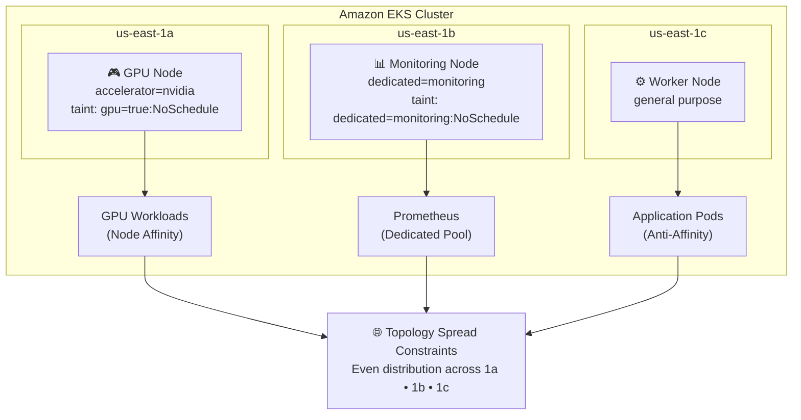

# Day 13 - Kubernetes Scheduling Patterns


Kubernetes doesn't place pods randomly — but left to defaults, it doesn't place them *intelligently* either. This project implements four core scheduling strategies on Amazon EKS to control workload placement for better **availability, isolation, resiliency, and resource utilization**.

**Goal →** GPU workloads on GPU nodes. Replicas spread across nodes. Traffic spread across AZs. Infra workloads on dedicated pools. No exceptions.

---
Production-grade workload placement on EKS — using labels, node affinity, taints, tolerations, pod anti-affinity, topology spread constraints, and dedicated node pools to control where and how your pods run.

## 🏗️ Architecture



# Phase 1 Setting up a EKS cluster

bash
```
apiVersion: eksctl.io/v1alpha5
kind: ClusterConfig

metadata:
  name: scheduling-lab
  region: us-east-1

availabilityZones:
- us-east-1a
- us-east-1b
- us-east-1c

managedNodeGroups:

- name: general

  instanceType: t3.medium

  desiredCapacity: 3

  availabilityZones:
   - us-east-1a
   - us-east-1b
   - us-east-1c


   eksctl create cluster -f cluster.yaml
```
wait for 15-20 mins for cluster to come up

verify the cluster


# Phase 2 Understanding Current Topology and added labels 

bash
```
kubectl get nodes \
-L topology.kubernetes.io/zone
```


Labal the nodes 

bash
```
kubectl label node ip-192-168-65-123.ec2.internal workload=general

 kubectl label node ip-192-168-45-14.ec2.internalworkload=general 

 kubectl label node ip-192-168-25-154.ec2.internal workload=gpu
```

verify the labels

bash
```
kubectl get nodes --show-labels
```


Real GPU nodes are expensive.

We'll emulate them.

bash
```
 kubectl label node ip-192-168-25-154.ec2.internal accelerator=nvidia
```
verify


# phase 3 - taint the nodes

bash
```
kubectl taint node ip-192-168-25-154.ec2.internal gpu=true:NoSchedule
```

verify 
bash
```
kubectl describe node ip-192-168-25-154.ec2.internal | grep -A3 Taints
```


we hve tained a node lets see sample deployment will schedule

bash
```
apiVersion: apps/v1
kind: Deployment
metadata:
  name: normal-app
spec:
  replicas: 3
  selector:
    matchLabels:
      app: normal-app
  template:
    metadata:
      labels:
        app: normal-app
    spec:
      containers:
      - name: nginx
        image: nginx
```

deploy and verify the pods

we can observe that pods are not sceduled on ip-192-168-25-154.ec2.internal because it is tainted


Now test to deploy gpu with tolerations

bash
```
apiVersion: apps/v1
kind: Deployment

metadata:
  name: gpu-app

spec:
  replicas: 1

  selector:
    matchLabels:
      app: gpu

  template:

    metadata:
      labels:
        app: gpu

    spec:

      tolerations:
      - key: gpu
        operator: Equal
        value: "true"
        effect: NoSchedule

      affinity:
        nodeAffinity:
          requiredDuringSchedulingIgnoredDuringExecution:
            nodeSelectorTerms:
            - matchExpressions:
              - key: accelerator
                operator: In
                values:
                - nvidia

      containers:
      - name: app
        image: nginx
```

verfiy pod is scheduled on the tainted node because of matching toleration on the pod

Objective → Ensure GPU workloads land only on GPU-capable nodes.

Techniques → Node Labels · Taints · Tolerations · Node Affinity


# Phase 4 Anti affinity

Objective → Prevent replicas from landing on the same node.

Benefits → High Availability · Fault Isolation · Better Resilience


bash
```
apiVersion: apps/v1
kind: Deployment

metadata:
  name: web

spec:
  replicas: 3

  selector:
    matchLabels:
      app: web

  template:

    metadata:
      labels:
        app: web

    spec:

      affinity:

        podAntiAffinity:

          requiredDuringSchedulingIgnoredDuringExecution:

          - labelSelector:

              matchExpressions:

              - key: app

                operator: In

                values:

                - web

            topologyKey: kubernetes.io/hostname

      containers:

      - name: nginx

        image: nginx
```

only replica needs to be there for one node, one is pending because node tainted the pod don't have any toleration to scedule on that


Zone Spreading

Objective → Distribute workloads evenly across Availability Zones.

Benefits → Multi-AZ Resilience · Reduced Blast Radius · Better Fault Tolerance

bash
```
apiVersion: apps/v1
kind: Deployment

metadata:
  name: api

spec:
  replicas: 6

  selector:
    matchLabels:
      app: api

  template:

    metadata:
      labels:
        app: api

    spec:

      topologySpreadConstraints:

      - maxSkew: 1

        topologyKey: topology.kubernetes.io/zone

        whenUnsatisfiable: DoNotSchedule

        labelSelector:

          matchLabels:
            app: api

      containers:

      - name: nginx

        image: nginx
```

deploy and verfiy the scheduling


# phase 5 Dedicated node pools

Objective → Reserve nodes exclusively for infrastructure workloads.

Examples → Prometheus · Grafana · ELK / OpenSearch · Security Agents · CI/CD Runners

  Choose one node 

  bash
  ```
  kubectl label node ip-192-168-45-14.ec2.internal dedicated=monitoring
  ```
 verify 
 


Tainting the node

bash
```
kubectl taint node ip-192-168-45-14.ec2.internal dedicated=monitoring:NoSchedule
```

deploy the monitoring workload

bash
```
apiVersion: apps/v1
kind: Deployment

metadata:
  name: prometheus

spec:
  replicas: 1

  selector:
    matchLabels:
      app: prometheus

  template:

    metadata:
      labels:
        app: prometheus

    spec:

      tolerations:

      - key: dedicated
        operator: Equal
        value: monitoring
        effect: NoSchedule

      affinity:

        nodeAffinity:

          requiredDuringSchedulingIgnoredDuringExecution:

            nodeSelectorTerms:

            - matchExpressions:

              - key: dedicated
                operator: In
                values:
                - monitoring

      containers:

      - name: prometheus

        image: prom/prometheus
```

deploy and verify


Only the monitoring node should host the pod.


After completing this project, you'll understand:

- ➤ How the Kubernetes scheduler makes placement decisions
- ➤ How to isolate GPU workloads onto dedicated hardware
- ➤ How to implement workload segregation via taints/tolerations
- ➤ How to design highly available applications with anti-affinity
- ➤ How to distribute applications across Availability Zones
- ➤ How to create dedicated infrastructure node pools
- ➤ Production scheduling strategies used in enterprise Kubernetes clusters
