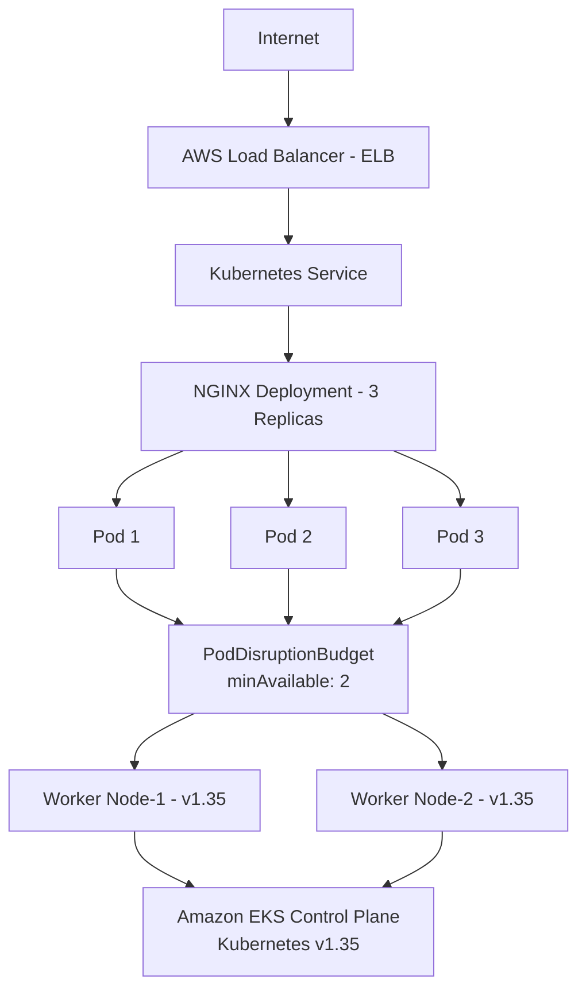
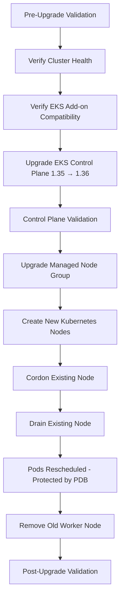
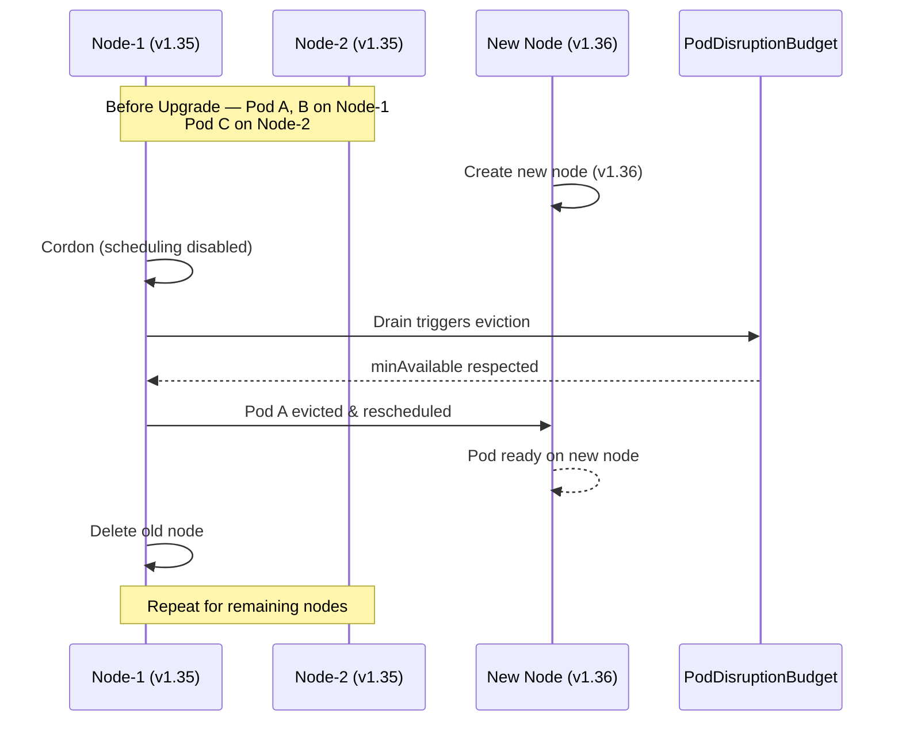

# ⚙️ Kubernetes Upgrade Strategy — Zero-Downtime EKS Upgrade


This project demonstrates how to safely upgrade an Amazon EKS cluster in production without dropping a single request. It covers the full lifecycle — pre-upgrade validation, control plane upgrade, managed node group rotation, pod rescheduling under a PodDisruptionBudget, and post-upgrade verification — along with a rollback plan for when things don't go as expected.

**Core practices implemented:**

- ➤ Control plane upgrade (1.35 → 1.36)
- ➤ Managed node group upgrade via rolling replacement
- ➤ PodDisruptionBudget (PDB) enforcement
- ➤ Node cordon and drain
- ➤ Rolling pod rescheduling
- ➤ Cluster health validation
- ➤ Rollback planning

- ## 🏗️ Architecture





## 🚦 Zero-Downtime Node Upgrade




# Phase 1 - Creating a EKS cluster with 1.35 version

bash
```
apiVersion: eksctl.io/v1alpha5
kind: ClusterConfig

metadata:
  name: eks-upgrade-lab
  region: us-east-1
  version: "1.28"

managedNodeGroups:
  - name: workers
    instanceType: t3.medium
    desiredCapacity: 2
    minSize: 2
    maxSize: 4
    volumeSize: 20
    amiFamily: AmazonLinux2
```


# Phase 2 deploy the workload

bash
```
apiVersion: apps/v1
kind: Deployment
metadata:
  name: nginx-demo
  namespace: upgrade-demo
spec:
  replicas: 3

  strategy:
    type: RollingUpdate
    rollingUpdate:
      maxUnavailable: 1
      maxSurge: 1

  selector:
    matchLabels:
      app: nginx-demo

  template:
    metadata:
      labels:
        app: nginx-demo
    spec:
      containers:
      - name: nginx
        image: nginx:1.27
        ports:
        - containerPort: 80

        resources:
          requests:
            cpu: "100m"
            memory: "128Mi"
          limits:
            cpu: "200m"
            memory: "256Mi"

        readinessProbe:
          httpGet:
            path: /
            port: 80
          initialDelaySeconds: 5
          periodSeconds: 5

        livenessProbe:
          httpGet:
            path: /
            port: 80
          initialDelaySeconds: 15
          periodSeconds: 10
```
deploy and verify


create a loadbalancer servicen for the deployment

bash
```
apiVersion: v1
kind: Service
metadata:
  name: nginx-service
  namespace: upgrade-demo
spec:
  selector:
    app: nginx-demo

  ports:
  - port: 80
    targetPort: 80

  type: LoadBalancer
```

deploy and verfiy 


Checking pod placement on worker nodes later used for upgrade of cluster


# Phase 3 Pod Disruption Budeget

A PodDisruptionBudget (PDB) protects your application from voluntary disruptions, such as:

Node drain (kubectl drain)
EKS managed node group upgrades
Cluster Autoscaler scale-down
Karpenter node consolidation
Manual node maintenance

It tells Kubernetes how many pods must remain available during these operations.

A PDB does not protect against involuntary disruptions like node crashes or hardware failures.

Our Application

We currently have:

Deployment
├── Replica 1
├── Replica 2
└── Replica 3

Without a PDB, Kubernetes could evict multiple pods during a node drain, increasing the risk of downtime.

With a PDB, Kubernetes will only evict pods if the required number of replicas stays available.


create PDB

bash
```
apiVersion: policy/v1
kind: PodDisruptionBudget
metadata:
  name: nginx-pdb
  namespace: upgrade-demo
spec:
  minAvailable: 2
  selector:
    matchLabels:
      app: nginx-demo
```
We have 3 replicas, so this configuration guarantees that at least 2 pods remain available during voluntary disruptions.

This means Kubernetes can evict only one pod at a time.


get detailed info by describe

bash
```
kubectl describe pdb nginx-pdb -n upgrade-demo
```


How It Works During a Node Drain

Imagine your pods are distributed like this:

Node-1
 ├── Pod-A
 └── Pod-B

Node-2
 └── Pod-C

When you drain Node-1:

Kubernetes attempts to evict Pod-A.
Pod-A is rescheduled to another node.
Kubernetes waits until the new pod is Ready.
Only then can it evict another pod, ensuring at least 2 pods remain available.

This behavior is what helps achieve zero-downtime upgrades.

# Phase 5 – Validate EKS Add-on Compatibility

Why is this important?

An EKS cluster isn't just the Kubernetes control plane. It also includes managed add-ons such as:

Amazon VPC CNI – networking for pods
CoreDNS – DNS resolution inside the cluster
kube-proxy – Kubernetes service networking
EKS Pod Identity Agent (if installed)

These add-ons must be compatible with the target Kubernetes version. In production, teams always verify them before upgrading the control plane.

checking current cluster version


listing add ons on the cluster


now check this add on versions of the above list


check comptabile versions of add ons in k8s 1.36

bash
```
aws eks describe-addon-versions \
  --addon-name vpc-cni \
  --kubernetes-version 1.36

  aws eks describe-addon-versions \
  --addon-name coredns \
  --kubernetes-version 1.36

  aws eks describe-addon-versions \
  --addon-name kube-proxy \
  --kubernetes-version 1.36

 ```


check cluster health before upgrading it

# phase 4 Upgrading control plane ( 1.35 -> 1.36)

What Happens During a Control Plane Upgrade?

Only the EKS-managed control plane is upgraded:

✅ Kubernetes API Server
✅ etcd (managed by EKS)
✅ Controller Manager
✅ Scheduler

we need need to upgrade worker nodes manually after this

During this step:

Applications continue running.
Existing pods are not restarted.
The Kubernetes API may briefly be unavailable (typically a few seconds), but workloads continue serving traffic.


Control Plane Upgrade

bash
```
aws eks update-cluster-version \
  --name eks-upgrade-lab \
  --region us-east-1 \
  --kubernetes-version 1.36
```


monitor the upgrade

bash
```
while true; do
  clear
  aws eks describe-cluster \
    --name eks-upgrade-lab \
    --region us-east-1 \
    --query "cluster.status"
  sleep 30
done
```
verfiy the version

bash
```
aws eks describe-cluster \
  --name eks-upgrade-lab \
  --region us-east-1 \
  --query "cluster.version"
```


Still deployment is up and running


verify everything is working fine after control plane upgrade


# Phase 7 – Upgrade the Managed Node Group,

Create replacement nodes on Kubernetes 1.36.
Cordon old nodes.
Drain them while respecting the PodDisruptionBudget.
Reschedule pods.
Terminate the old nodes.

list node groups

bash
```
eksctl get nodegroup \
  --cluster eks-upgrade-lab \
  --region us-east-1
```


upgrade the node group

bash
```
eksctl upgrade nodegroup \
  --cluster eks-upgrade-lab \
  --name workers \
  --region us-east-1
```


check the node group version

bash
```
aws eks update-nodegroup-version \
  --cluster-name eks-upgrade-lab \
  --nodegroup-name workers \
  --region us-east-1
```


Monitor the Upgrade

bash
```
aws eks describe-nodegroup \
  --cluster-name eks-upgrade-lab \
  --nodegroup-name workers \
  --region us-east-1 \
  --query "nodegroup.status"
```

check the nodes


verify everything


# Phase 8 – Post-Upgrade Validation & Rollback Runbook

verify kubernetes version


verfiy components


check Events

bash
```
kubectl get events -A --sort-by=.lastTimestamp >> Events.txt
```

# Rollback Strategy

You cannot downgrade an EKS control plane.

Once the control plane is upgraded, AWS does not support rolling it back to an earlier Kubernetes version.

What can you do?
1. Before the upgrade
Export Kubernetes manifests:
kubectl get all -A -o yaml > cluster-backup.yaml
Backup persistent data (for example, database snapshots or volume snapshots).
Verify infrastructure code (Terraform, CloudFormation, or eksctl configs) is up to date.

#  If the upgrade causes issues

Possible actions:

Roll back your application deployment:
kubectl rollout undo deployment/nginx-demo -n upgrade-demo
Roll back Helm releases (if Helm is used):
helm rollback <release-name> <revision>
Restore configuration from Git if using GitOps.

# If the cluster becomes unusable

Recovery plan:

Create a new EKS cluster on a supported Kubernetes version.
Install required add-ons.
Restore workloads from Git or backups.
Restore persistent data.
Switch DNS or load balancer traffic to the new cluster.
Decommission the old cluster after validation.

## 🎓 Learning Outcomes


- ➤ Kubernetes version upgrade planning
- ➤ Amazon EKS control plane upgrades
- ➤ Managed node group upgrades
- ➤ PodDisruptionBudget implementation
- ➤ Node cordon and drain workflow
- ➤ Zero-downtime application upgrades
- ➤ Cluster validation techniques
- ➤ Production rollback planning
- ➤ Real-world EKS operational best practices


