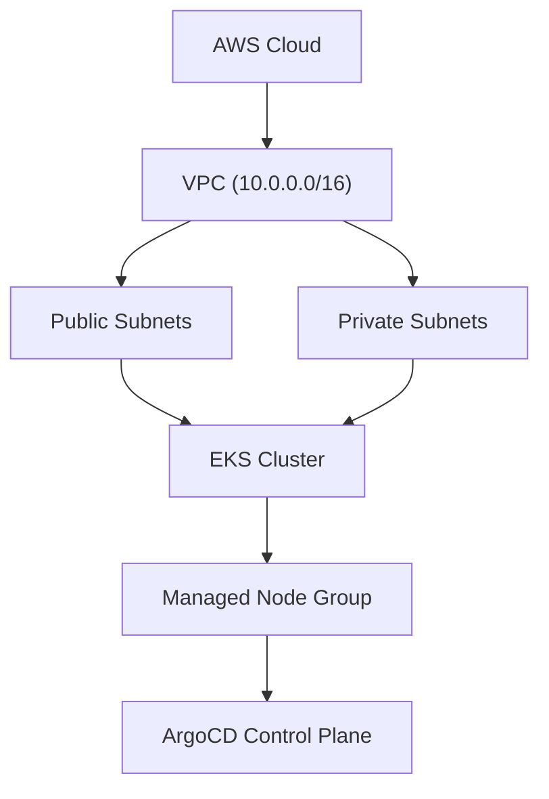
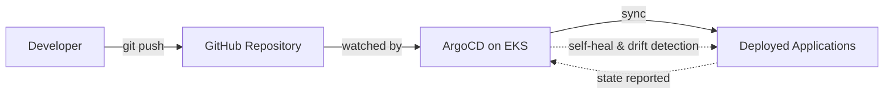

# 🚀 ArgoCD Multi-Cluster GitOps on AWS EKS

> Building a production-grade GitOps platform using ArgoCD, Terraform, AWS EKS, and Kubernetes.


## Architecture

### Infrastructure Layer



### GitOps Delivery Flow (Target State)


Setting up resources for multi cluster gitops

versions.tf 

bash 
```
terraform {
  required_version = "~> 1.15.0"

  required_providers {
    aws = {
      source  = "hashicorp/aws"
      version = "~> 6.2"
    }
  }
}
```

required_version ensures everyone uses a compatible Terraform version.
required_providers pins the AWS provider to a compatible major version while allowing minor updates.

providers.tf

bash
```
provider "aws" {
  region = var.aws_region

  default_tags {
    tags = local.common_tags
  }
}
```

variables.tf

bash
```
variable "aws_region" {
  description = "AWS Region"

  type = string
}

variable "project_name" {
  description = "Project Name"

  type = string
}

variable "environment" {
  description = "Environment"

  type = string
}

variable "owner" {
  description = "Resource Owner"

  type = string
}
```
These are the global variables that every module will use.

bash
```
aws_region  = "us-east-1"

project_name = "argocd-multicluster"

environment = "management"

owner = "Rabindranath"
```
This keeps environment-specific values separate from the module code.

remote backend config

bash
```
terraform {
  backend "s3" {
    bucket       = "tfstate-rabindranath-argocd-multicluster"
    key          = "management/terraform.tfstate"
    region       = "us-east-1"
    use_lockfile = true
  }
}
```


# Phase 2 – VPC Module

adding more variables in modules/vpc/variables.tf

bash
```
variable "project_name" {
  description = "Project name"
  type        = string
}

variable "environment" {
  description = "Environment name"
  type        = string
}

variable "vpc_cidr" {
  description = "VPC CIDR Block"
  type        = string
}
```

locals.tf

bash
```
locals {
  common_tags = {
    Project     = var.project_name
    Environment = var.environment
    ManagedBy   = "Terraform"
    Module      = "VPC"
  }
}
```
modules/vpc/main.tf

bash
```
resource "aws_vpc" "this" {

  cidr_block = var.vpc_cidr

  enable_dns_support = true

  enable_dns_hostnames = true

  tags = merge(
    local.common_tags,
    {
      Name = "${var.project_name}-${var.environment}-vpc"
    }
  )
}
```

modules/vpc/outputs.tf

bash
```
output "vpc_id" {
  description = "VPC ID"

  value = aws_vpc.this.id
}

output "vpc_cidr" {
  description = "VPC CIDR"

  value = aws_vpc.this.cidr_block
}
```

adding environment variables in /environments/management/variables.tf

bash
```
variable "vpc_cidr" {
  description = "Management VPC CIDR"

  type = string
}
```
/environments/management/terraform.tfvars
bash
```
vpc_cidr = "10.0.0.0/16"
```
calling the module

bash
```
module "vpc" {

  source = "../../modules/vpc"

  project_name = var.project_name

  environment = var.environment

  vpc_cidr = var.vpc_cidr
}
```

exposing outputs

bash
```
output "vpc_id" {
  value = module.vpc.vpc_id
}

output "vpc_cidr" {
  value = module.vpc.vpc_cidr
}
```

validating the code and plan


applying  changes


Internet Gateway (IGW) 

modules/vpc/main.tf

bash
```
############################################
# Internet Gateway
############################################

resource "aws_internet_gateway" "this" {
  vpc_id = aws_vpc.this.id

  tags = merge(
    local.common_tags,
    {
      Name = "${var.project_name}-${var.environment}-igw"
    }
  )
}
```
modules/vpc/outputs.tf

bash
```
output "internet_gateway_id" {
  description = "Internet Gateway ID"

  value = aws_internet_gateway.this.id
}
```
terraform/environments/management/outputs.tf

bash
```
output "internet_gateway_id" {
  value = module.vpc.internet_gateway_id
}
```

verify and apply

bash
```
terraform fmt -recursive
terraform validate
terraform plan
```
terraform apply and outputs


setting up public subnets

modules/vpc/variables.tf
bash
```
variable "public_subnet_cidrs" {
  description = "List of public subnet CIDRs"
  type        = list(string)
}

variable "availability_zones" {
  description = "Availability Zones"
  type        = list(string)
}
```

terraform.tfvars
bash
```
availability_zones = [
  "us-east-1a",
  "us-east-1b"
]

public_subnet_cidrs = [
  "10.0.1.0/24",
  "10.0.2.0/24"
]
```

environments/management/variables.tf

bash
```
variable "availability_zones" {
  type = list(string)
}

variable "public_subnet_cidrs" {
  type = list(string)
}
```
In environments/management/main.tf

bash
```
module "vpc" {

  source = "../../modules/vpc"

  project_name = var.project_name
  environment  = var.environment

  vpc_cidr = var.vpc_cidr

  availability_zones = var.availability_zones

  public_subnet_cidrs = var.public_subnet_cidrs
}
```
modules/vpc/main.tf

bash
```
############################################
# Public Subnets
############################################

resource "aws_subnet" "public" {

  count = length(var.public_subnet_cidrs)

  vpc_id = aws_vpc.this.id

  cidr_block = var.public_subnet_cidrs[count.index]

  availability_zone = var.availability_zones[count.index]

  map_public_ip_on_launch = true

  tags = merge(
    local.common_tags,
    {
      Name = "${var.project_name}-${var.environment}-public-${count.index + 1}"

      "kubernetes.io/role/elb" = "1"
    }
  )
}
```
modules/vpc/outputs.tf

bash
```
output "public_subnet_ids" {
  value = aws_subnet.public[*].id
}
```
environments/management/outputs.tf

bash
```
output "public_subnet_ids" {
  value = module.vpc.public_subnet_ids
}
```

verify and validate ,plan 


Terraform apply


Setting up private subnets ,similiar to public subenets


Setting up NAT Gateway and Elastic Ip

bash
```
############################################
# Elastic IP for NAT Gateway
############################################

resource "aws_eip" "nat" {
  domain = "vpc"

  tags = merge(
    local.common_tags,
    {
      Name = "${var.project_name}-${var.environment}-nat-eip"
    }
  )
}
```
make chnages in output.tf and validate ,plan and apply


NAT gateway

bash
```
############################################
# NAT Gateway
############################################

resource "aws_nat_gateway" "this" {

  allocation_id = aws_eip.nat.id

  subnet_id = aws_subnet.public[0].id

  connectivity_type = "public"

  tags = merge(
    local.common_tags,
    {
      Name = "${var.project_name}-${var.environment}-nat"
    }
  )

  depends_on = [
    aws_internet_gateway.this
  ]
}
```


setting Route tables and sssociate to respective subnets

bash
```
resource "aws_vpc" "this" {

  cidr_block = var.vpc_cidr

  enable_dns_support = true

  enable_dns_hostnames = true

  tags = merge(
    local.common_tags,
    {
      Name = "${var.project_name}-${var.environment}-vpc"
    }
  )
}
############################################
# Internet Gateway
############################################

resource "aws_internet_gateway" "this" {
  vpc_id = aws_vpc.this.id

  tags = merge(
    local.common_tags,
    {
      Name = "${var.project_name}-${var.environment}-igw"
    }
  )
}
############################################
# Public Subnets
############################################

resource "aws_subnet" "public" {

  count = length(var.public_subnet_cidrs)

  vpc_id = aws_vpc.this.id

  cidr_block = var.public_subnet_cidrs[count.index]

  availability_zone = var.availability_zones[count.index]

  map_public_ip_on_launch = true

  tags = merge(
    local.common_tags,
    {
      Name = "${var.project_name}-${var.environment}-public-${count.index + 1}"

      "kubernetes.io/role/elb" = "1"
    }
  )
}
############################################
# Private Subnets
############################################

resource "aws_subnet" "private" {

  count = length(var.private_subnet_cidrs)

  vpc_id = aws_vpc.this.id

  cidr_block = var.private_subnet_cidrs[count.index]

  availability_zone = var.availability_zones[count.index]

  map_public_ip_on_launch = false

  tags = merge(
    local.common_tags,
    {
      Name = "${var.project_name}-${var.environment}-private-${count.index + 1}"

      "kubernetes.io/role/internal-elb" = "1"
    }
  )
}
############################################
# Elastic IP for NAT Gateway
############################################

resource "aws_eip" "nat" {
  domain = "vpc"

  tags = merge(
    local.common_tags,
    {
      Name = "${var.project_name}-${var.environment}-nat-eip"
    }
  )
}
############################################
# NAT Gateway
############################################

resource "aws_nat_gateway" "this" {

  allocation_id = aws_eip.nat.id

  subnet_id = aws_subnet.public[0].id

  connectivity_type = "public"

  tags = merge(
    local.common_tags,
    {
      Name = "${var.project_name}-${var.environment}-nat"
    }
  )

  depends_on = [
    aws_internet_gateway.this
  ]
}
############################################
# Public Route Table
############################################

resource "aws_route_table" "public" {

  vpc_id = aws_vpc.this.id

  tags = merge(
    local.common_tags,
    {
      Name = "${var.project_name}-${var.environment}-public-rt"
    }
  )
}
############################################
# Internet Route
############################################

resource "aws_route" "public_internet" {

  route_table_id = aws_route_table.public.id

  destination_cidr_block = "0.0.0.0/0"

  gateway_id = aws_internet_gateway.this.id
}

############################################
# Private Route Table
############################################

resource "aws_route_table" "private" {

  vpc_id = aws_vpc.this.id

  tags = merge(
    local.common_tags,
    {
      Name = "${var.project_name}-${var.environment}-private-rt"
    }
  )
}

############################################
# NAT Route
############################################

resource "aws_route" "private_nat" {

  route_table_id = aws_route_table.private.id

  destination_cidr_block = "0.0.0.0/0"

  nat_gateway_id = aws_nat_gateway.this.id
}

############################################
# Public Route Table Association
############################################

resource "aws_route_table_association" "public" {

  count = length(aws_subnet.public)

  subnet_id = aws_subnet.public[count.index].id

  route_table_id = aws_route_table.public.id
}

############################################
# Private Route Table Association
############################################

resource "aws_route_table_association" "private" {

  count = length(aws_subnet.private)

  subnet_id = aws_subnet.private[count.index].id

  route_table_id = aws_route_table.private.id
}
```

validate and plan , apply


# Phase 3 – IAM

Create all IAM resources required for EKS.

AWS IAM
│
├── EKS Cluster Role
│
├── EKS Node Role
│
├── Trust Policies
│
└── AWS Managed Policy Attachments

modules/iam/variables.tf

bash
```
variable "project_name" {
  description = "Project name"
  type        = string
}

variable "environment" {
  description = "Environment name"
  type        = string
}
```

EKS Cluster IAM Role → Allows the EKS control plane to communicate with AWS services on your behalf.

              AWS EKS Service
                     │
          sts:AssumeRole
                     │
                     ▼
         EKS Cluster IAM Role
                     │
                     ▼
          AWS Managed Policies

bash
```
############################################
# EKS Cluster Trust Policy
############################################

data "aws_iam_policy_document" "eks_cluster_assume_role" {

  statement {

    effect = "Allow"

    principals {

      type = "Service"

      identifiers = [
        "eks.amazonaws.com"
      ]
    }

    actions = [
      "sts:AssumeRole"
    ]
  }
}
############################################
# EKS Cluster IAM Role
############################################

resource "aws_iam_role" "eks_cluster" {

  name = "${var.project_name}-${var.environment}-eks-cluster-role"

  assume_role_policy = data.aws_iam_policy_document.eks_cluster_assume_role.json

  tags = merge(
    local.common_tags,
    {
      Name = "${var.project_name}-${var.environment}-eks-cluster-role"
    }
  )
}
```


verify


EKS Node IAM Role 

terraform/modules/iam/main.tf

bash
```
############################################
# EKS Node Trust Policy
############################################

data "aws_iam_policy_document" "eks_node_assume_role" {

  statement {

    effect = "Allow"

    principals {

      type = "Service"

      identifiers = [
        "ec2.amazonaws.com"
      ]
    }

    actions = [
      "sts:AssumeRole"
    ]
  }
}

############################################
# EKS Node IAM Role
############################################

resource "aws_iam_role" "eks_node" {

  name = "${var.project_name}-${var.environment}-eks-node-role"

  assume_role_policy = data.aws_iam_policy_document.eks_node_assume_role.json

  tags = merge(
    local.common_tags,
    {
      Name = "${var.project_name}-${var.environment}-eks-node-role"
    }
  )
}

```


Attach the required AWS managed policies to the IAM roles.

terraform/modules/iam/main.tf

bash
```

# EKS Cluster Policy Attachment


resource "aws_iam_role_policy_attachment" "eks_cluster_policy" {

  role = aws_iam_role.eks_cluster.name

  policy_arn = "arn:aws:iam::aws:policy/AmazonEKSClusterPolicy"
}


# Worker Node Policy


resource "aws_iam_role_policy_attachment" "eks_node_worker_policy" {

  role = aws_iam_role.eks_node.name

  policy_arn = "arn:aws:iam::aws:policy/AmazonEKSWorkerNodePolicy"
}

############################################
# ECR Pull Policy
############################################

resource "aws_iam_role_policy_attachment" "eks_node_ecr_policy" {

  role = aws_iam_role.eks_node.name

  policy_arn = "arn:aws:iam::aws:policy/AmazonEC2ContainerRegistryPullOnly"
}

############################################
# VPC CNI Policy
############################################

resource "aws_iam_role_policy_attachment" "eks_node_cni_policy" {

  role = aws_iam_role.eks_node.name

  policy_arn = "arn:aws:iam::aws:policy/AmazonEKS_CNI_Policy"
}
```
terraform validate,plan ,apply

bash
```
aws iam list-attached-role-policies \
  --role-name argocd-multicluster-management-eks-cluster-role

aws iam list-attached-role-policies \
  --role-name argocd-multicluster-management-eks-node-role

```


bash
```

                 AWS
                  │
      ┌───────────┴───────────┐
      ▼                       ▼
EKS Control Plane      EC2 Worker Nodes
      │                       │
      ▼                       ▼
 Cluster IAM Role       Node IAM Role
      │                       │
      ▼                       ▼
 AmazonEKSClusterPolicy  AmazonEKSWorkerNodePolicy
                          AmazonEC2ContainerRegistryPullOnly
                          AmazonEKS_CNI_Policy

```

# Phase 4 – EKS Cluster

terraform/environments/management/main.tf

bash
```
module "eks" {
  source = "../../modules/eks"

  project_name = var.project_name
  environment  = var.environment

  cluster_role_arn  = module.iam.cluster_role_arn
  private_subnet_ids = module.vpc.private_subnet_ids
}
```

terraform/modules/iam/main.tf
bash
```
############################################
# EKS Cluster
############################################

resource "aws_eks_cluster" "this" {

  name = "${var.project_name}-${var.environment}"

  role_arn = var.cluster_role_arn

  version = "1.33"

  access_config {
    authentication_mode                         = "API_AND_CONFIG_MAP"
    bootstrap_cluster_creator_admin_permissions = true
  }

  vpc_config {

    subnet_ids = var.private_subnet_ids

    endpoint_private_access = true

    endpoint_public_access = true
  }

  tags = merge(
    local.common_tags,
    {
      Name = "${var.project_name}-${var.environment}"
    }
  )
}
```


Verify EKS cluster

bash
```
aws eks update-kubeconfig \
  --name argocd-multicluster-management \
  --region us-east-1

  kubectl get nodes
```


Phase 5 – Managed Node Group

Create an AWS Managed Node Group.

AWS will automatically:

Launch EC2 instances
Join them to the cluster
Replace unhealthy nodes
Handle upgrades


bash
```
variable "project_name" {
  type = string
}

variable "environment" {
  type = string
}

variable "cluster_name" {
  type = string
}

variable "node_role_arn" {
  type = string
}

variable "private_subnet_ids" {
  type = list(string)
}
```

terraform/environments/management/main.tf

bash
```
module "node_group" {
  source = "../../modules/node-group"

  project_name = var.project_name
  environment  = var.environment

  cluster_name      = module.eks.cluster_name
  node_role_arn     = module.iam.node_role_arn
  private_subnet_ids = module.vpc.private_subnet_ids
}
```
terraform/modules/node-group/main.tf

bash
```
############################################
# EKS Managed Node Group
############################################

resource "aws_eks_node_group" "this" {

  cluster_name = var.cluster_name

  node_group_name = "${var.project_name}-${var.environment}-nodes"

  node_role_arn = var.node_role_arn

  subnet_ids = var.private_subnet_ids

  ami_type = "AL2023_x86_64_STANDARD"

  capacity_type = "ON_DEMAND"

  instance_types = [
    "t3.medium"
  ]

  scaling_config {

    desired_size = 2

    min_size = 2

    max_size = 3
  }

  update_config {
    max_unavailable = 1
  }

  tags = merge(
    local.common_tags,
    {
      Name = "${var.project_name}-${var.environment}-node-group"
    }
  )
}
```


bash
```
aws eks update-kubeconfig \
  --region us-east-1 \
  --name argocd-multicluster-management

  kubectl get nodes
```


Configuring  EKS Add-ons

Install the AWS-managed EKS add-ons required for a production-ready cluster.

VPC CNI – Pod networking
CoreDNS – Cluster DNS
kube-proxy – Kubernetes networking
EBS CSI Driver – Dynamic EBS volume provisioning

These are managed by AWS, so upgrades are much easier.

bash
```
resource "aws_eks_addon" "vpc_cni" {
  cluster_name = var.cluster_name
  addon_name   = "vpc-cni"
}

resource "aws_eks_addon" "coredns" {
  cluster_name = var.cluster_name
  addon_name   = "coredns"
}

resource "aws_eks_addon" "kube_proxy" {
  cluster_name = var.cluster_name
  addon_name   = "kube-proxy"
}

resource "aws_eks_addon" "ebs_csi" {
  cluster_name = var.cluster_name
  addon_name   = "aws-ebs-csi-driver"
}
```

validate ,plan ,apply


Prepare EKS for GitOps

Before installing ArgoCD, there are two production prerequisites:

✅ OIDC Provider
✅ IRSA (IAM Roles for Service Accounts)

check OIDC

bash
```
aws eks describe-cluster \
  --name argocd-multicluster-management \
  --region us-east-1 \
  --query "cluster.identity.oidc.issuer" \
  --output text
```


associate OIDC

bash
```
eksctl utils associate-iam-oidc-provider \
  --cluster argocd-multicluster-management \
  --region us-east-1 \
  --approve
```


IRSA (IAM Roles for Service Accounts)

IRSA allows a Kubernetes ServiceAccount to securely assume an AWS IAM role without storing AWS access keys inside pods.

Create the IRSA Trust Policy

We'll create an IAM role that only the EBS CSI Controller ServiceAccount can assume.

bash
```
############################################
# EBS CSI IRSA Trust Policy
############################################

data "aws_iam_policy_document" "ebs_csi_irsa" {

  statement {

    effect = "Allow"

    actions = [
      "sts:AssumeRoleWithWebIdentity"
    ]

    principals {
      type = "Federated"

      identifiers = [
        var.oidc_provider_arn
      ]
    }

    condition {

      test = "StringEquals"

      variable = "${replace(var.oidc_issuer_url, "https://", "")}:sub"

      values = [
        "system:serviceaccount:kube-system:ebs-csi-controller-sa"
      ]
    }

    condition {

      test = "StringEquals"

      variable = "${replace(var.oidc_issuer_url, "https://", "")}:aud"

      values = [
        "sts.amazonaws.com"
      ]
    }
  }
}
############################################
# EBS CSI IRSA Role
############################################

resource "aws_iam_role" "ebs_csi_irsa" {

  name = "${var.project_name}-${var.environment}-ebs-csi-irsa"

  assume_role_policy = data.aws_iam_policy_document.ebs_csi_irsa.json

  tags = merge(
    local.common_tags,
    {
      Name = "${var.project_name}-${var.environment}-ebs-csi-irsa"
    }
  )
}
```

Updating a iam module with OIDC details

bash
```
module "iam" {

  source = "../../modules/iam"

  project_name = var.project_name
  environment  = var.environment

  oidc_provider_arn = "arn:aws:iam::497508796460:oidc-provider/oidc.eks.us-east-1.amazonaws.com/id/04BBFEC0FAB11A298B9DF4E58E7D8057"

  oidc_issuer_url = module.eks.oidc_issuer_url
}
```


Attach the AWS Managed Policy

bash
```
############################################
# EBS CSI Driver Policy
############################################

resource "aws_iam_role_policy_attachment" "ebs_csi_policy" {

  role = aws_iam_role.ebs_csi_irsa.name

  policy_arn = "arn:aws:iam::aws:policy/service-role/AmazonEBSCSIDriverPolicy"
}
```

validate ,plan and apply

verify

bash
```
aws iam list-attached-role-policies \
  --role-name argocd-multicluster-management-ebs-csi-irsa
```


Install EBS CSI Driver with IRSA

Tell EKS to use the IRSA role we just created when running the EBS CSI Controller.

terraform/modules/addons/main.tf

bash
```
resource "aws_eks_addon" "ebs_csi" {

  cluster_name = var.cluster_name

  addon_name = "aws-ebs-csi-driver"

  service_account_role_arn = var.ebs_csi_irsa_role_arn

  resolve_conflicts_on_create = "OVERWRITE"

  resolve_conflicts_on_update = "OVERWRITE"
}
```

terraform/environments/management/main.tf

bash
```
module "addons" {

  source = "../../modules/addons"

  cluster_name = module.eks.cluster_name

  ebs_csi_irsa_role_arn = module.iam.ebs_csi_irsa_role_arn
}
```

validate plan and apply

verify

bash
```
aws eks describe-addon \
  --cluster-name argocd-multicluster-management \
  --addon-name aws-ebs-csi-driver \
  --region us-east-1
```


# Install ArgoCD

Install ArgoCD into the management EKS cluster.

1. check the current context and create a namespace argocd

bash
```
kubectl create namespace argocd
```

 We keep ArgoCD isolated from application workloads.

This makes it easier to:

Upgrade ArgoCD
Back it up
Troubleshoot it
Manage RBAC

add helm repo and update 
bash
```
helm repo add argo https://argoproj.github.io/argo-helm

helm repo update
```

verify the repo

bash
```
helm search repo argo/argo-cd
```


Install ArgoCD

bash
```
helm install argocd argo/argo-cd \
  --namespace argocd
```


verfiy helm release and pods in argocd

bash
```
helm list -n argocd

kubectl get pods -n argocd
```


expose argocd to UI

bash
```
kubectl port-forward svc/argocd-server -n argocd 8080:443
```

get password to login 

bash
```
kubectl -n argocd get secret argocd-initial-admin-secret \
  -o jsonpath="{.data.password}" | base64 --decode
```
user as admin


#  Phase 6 Multi-Cluster Management

Create 4 Kind clusters( instead of EKS clusters costs more , creating a local setup) and register them with the management EKS cluster running ArgoCD.

Installing kind

bash
```
brew install kind
```


create a cluster

bash
```
kind: Cluster
apiVersion: kind.x-k8s.io/v1alpha4

networking:
  disableDefaultCNI: false

nodes:
  - role: control-plane
  - role: worker
  - role: worker
```
creating dev cluster

bash
```
kind create cluster \
  --name dev \
  --config kind-config.yaml
```


checking the context
bash
```
kubectl config get-contexts
```


switchig  to dev cluster

bash
```
kubectl config use-context kind-dev
```

verify the nodes in dev cluster


we'll create QA, Stage, and Prod using the exact same configuration.

bash
```
kind create cluster --name qa --config kind-config.yaml

kind create cluster --name stage --config kind-config.yaml

kind create cluster --name prod --config kind-config.yaml
```

verfiy the kind clusters
bash
```
kind get clusters
```


verfiy the contexts


Verfiy the nodes in each cluster

bash
```
kubectl --context kind-dev get nodes

kubectl --context kind-qa get nodes

kubectl --context kind-stage get nodes

kubectl --context kind-prod get nodes
```


# Register the Kind Clusters with ArgoCD

The current context would be management cluster

bash
```
```


not able to register

argo cd server is running inside EKS. When it tries to reach 127.0.0.1, it's trying to reach itself inside the pod, not my laptop. That's why argocd cluster add failed.

Now we can't able to connect from management eks cluster we cna try to setup management cluster in kind


bash
```
kind create cluster \
  --name management \
  --config kind-config.yaml
```

I also noticed

You currently have:

✅ 4 Kind clusters
✅ 12 Kind nodes
✅ 2 Docker Compose containers
✅ Docker Desktop running
✅ EKS cluster

That's 15+ containers already running.

If Docker Desktop is limited to 4 GB RAM, creating the fifth cluster (Management) often fails exactly like this.
verfiy clusters and contexts

bash
```
docker info | grep -E "CPUs|Total Memory"

docker system df

```


changing resources


apply and restart docker


remove the existing cluster and create again


bash
```
kind get clusters

kubectl config get-contexts
```
Install ArgoCD on the Management Kind Cluster( not able to use previously created argocd in EKS)


bash
```
kubectl get pods -n argocd
```

Not able to connect to management cluster API due to memory issue so chnaging kind-config.yaml

bash

```
kind: Cluster
apiVersion: kind.x-k8s.io/v1alpha4

nodes:
- role: control-plane
```

creating with minimal no of nodes

bash
```
kind create cluster --name management --config kind-config.yaml

kind create cluster --name dev --config kind-config.yaml

kind create cluster --name qa --config kind-config.yaml

kind create cluster --name stage --config kind-config.yaml

kind create cluster --name prod --config kind-config.yaml
```

verfiy clusters


switch to kind management

bash
  ```
kubectl config use-context kind-management
```

then install argo cd


port forward

bash
```
kubectl port-forward svc/argocd-server -n argocd 8080:443
```
not able  register the kind clusters to argo cd to local networking limitation


## Kind

Learned a valuable limitation:

Default Kind clusters expose the Kubernetes API using localhost.

This works for local `kubectl` but not for a management cluster attempting to manage other Kind clusters.

Better way to implement ArgoCd in EKS we are going to do that but it s cost sensitive

