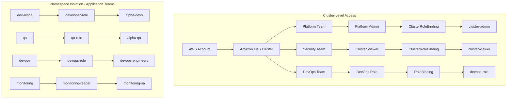
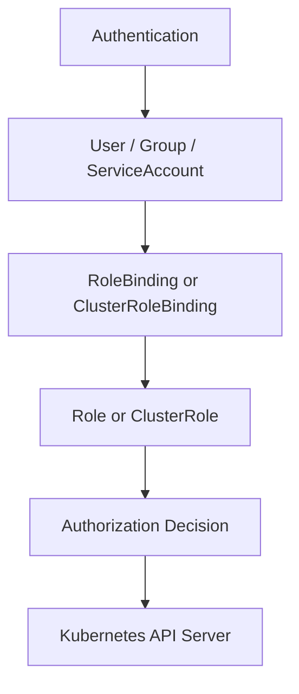
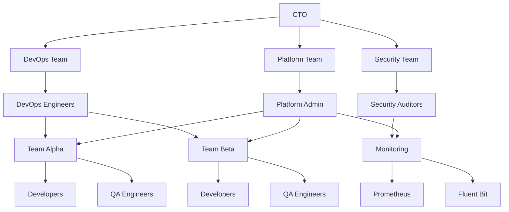
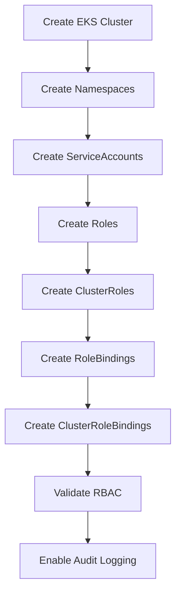

# 🔐 Kubernetes RBAC — Enterprise Access Model on Amazon EKS

*Use Case 14 — Part of the #100DaysOfDevOps series*


A production-style implementation of Kubernetes Role-Based Access Control (RBAC) on Amazon EKS. This project designs and implements secure, least-privilege access for multiple engineering teams using Roles, ClusterRoles, RoleBindings, ClusterRoleBindings, ServiceAccounts, namespace isolation, and Kubernetes audit logging.

**Highlights**
- 8 isolated namespaces mapped to distinct teams and functions
- Least-privilege Roles & ClusterRoles for Developers, QA, DevOps, Security, and Platform teams
- Dedicated ServiceAccounts for CI/CD, monitoring, logging, and backup workloads
- Cluster-wide audit logging enabled for compliance and traceability
- Every access boundary validated with `kubectl auth can-i` impersonation tests

---

## 🏗️ Architecture

The model separates concerns at two levels: cluster-wide access for platform, security, and DevOps leadership, and namespace-isolated access for individual application teams.



Every call to the API server is evaluated the same way, regardless of which team is asking:

## 🔄 RBAC Authorization Flow



## 🏢 Enterprise Organization

This mirrors how the underlying org chart maps onto cluster access:



---

## 📁 Repository Structure

```text
Usecase-14-RBAC-Enterprise/
├── architecture/
├── cluster/
│   └── eks-cluster.yaml
├── manifests/
│   ├── audit/
│   ├── namespaces/
│   ├── serviceaccounts/
│   ├── roles/
│   ├── clusterroles/
│   ├── rolebindings/
│   ├── clusterrolebindings/
│   └── examples/
├── scripts/
└── README.md
```

| Folder | Contents |
|---|---|
| `architecture/` | Diagrams and design notes for the RBAC model |
| `cluster/` | `eksctl` cluster configuration |
| `manifests/` | Kubernetes YAML, grouped by RBAC resource type |
| `scripts/` | Automation helpers for setup, validation, and teardown |

---

## 🧰 Tech Stack

| Category | Tools |
|---|---|
| Cloud Platform | Amazon EKS, AWS IAM, AWS CLI |
| Container Orchestration | Kubernetes, RBAC |
| CLI & Automation | kubectl, eksctl |
| Configuration | YAML |
| Observability & Audit | CloudWatch Logs |

---

## 🗂️ Namespace Layout

| Namespace | Purpose |
|---|---|
| `platform` | Platform Engineering |
| `dev-alpha` | Team Alpha Applications |
| `dev-beta` | Team Beta Applications |
| `qa` | QA Workloads |
| `devops` | DevOps Operations |
| `monitoring` | Monitoring Stack |
| `security` | Security Tools |
| `cicd` | CI/CD Workloads |

---

## 🔐 RBAC Components

### Roles (namespace-scoped)

| Role | Namespace | Purpose |
|---|---|---|
| Developer Role | `dev-alpha` | Day-to-day application development access |
| QA Role | `qa` | Testing and QA workload access |
| DevOps Role | `devops` | DevOps operational access |
| CI/CD Role | `cicd` | CI/CD pipeline execution access |

### ClusterRoles (cluster-scoped)

| ClusterRole | Purpose |
|---|---|
| Cluster Viewer | Cluster-wide read-only access |
| Monitoring Reader | Read access to metrics and logs for observability tooling |
| Impersonator | Allows impersonating users/groups for RBAC testing and troubleshooting |
| `cluster-admin` (built-in) | Full administrative access, cluster-wide |

### RoleBindings

| RoleBinding | Binds Role | Namespace |
|---|---|---|
| Alpha Developer Binding | Developer Role | `dev-alpha` |
| QA Binding | QA Role | `qa` |
| DevOps Binding | DevOps Role | `devops` |
| CI/CD Binding | CI/CD Role | `cicd` |

### ClusterRoleBindings

| ClusterRoleBinding | Binds ClusterRole | Bound Identity |
|---|---|---|
| Platform Admin | `cluster-admin` | Platform Team |
| Security Auditor | Cluster Viewer | Security Team |
| Monitoring ServiceAccount | Monitoring Reader | `monitoring-sa` |
| Impersonator | Impersonator | Designated test / debug identity |

---

## 👤 ServiceAccounts

| ServiceAccount | Purpose |
|---|---|
| `cicd-bot` | CI/CD Deployments |
| `monitoring-sa` | Prometheus |
| `logging-sa` | Fluent Bit |
| `backup-sa` | Backup Jobs |

---

## 📊 Access & Permission Matrices

### Enterprise Permission Matrix

| Role | Namespace | Scope |
|---|---|---|
| Developer | `dev-alpha` | Namespace |
| QA Engineer | `qa` | Namespace |
| DevOps Engineer | `devops` | Namespace |
| Security Auditor | Cluster | Cluster |
| Platform Admin | Cluster | Cluster |
| Monitoring | Cluster | Cluster |

### Detailed Access Matrix

| Capability | Developer | QA | DevOps | Security | Platform |
|---|---|---|---|---|---|
| View Pods | ✅ | ✅ | ✅ | ✅ | ✅ |
| View Logs | ✅ | ✅ | ✅ | ✅ | ✅ |
| Exec into Pods | ❌ | ✅ | ✅ | ❌ | ✅ |
| Update Deployments | ✅ | ❌ | ✅ | ❌ | ✅ |
| Delete Pods | ✅ | ❌ | ✅ | ❌ | ✅ |
| Manage Secrets | ❌ | ❌ | ✅ | ❌ | ✅ |
| Manage Ingress | ❌ | ❌ | ✅ | ❌ | ✅ |
| Create Namespace | ❌ | ❌ | ❌ | ❌ | ✅ |
| Manage RBAC | ❌ | ❌ | ❌ | ❌ | ✅ |
| Manage Nodes | ❌ | ❌ | ❌ | ✅ (Read) | ✅ |

---

## ⚙️ Project Workflow



---

## 🚀 Getting Started

### Prerequisites

- An AWS account with permissions to create EKS clusters and IAM roles
- [`awscli`](https://aws.amazon.com/cli/) configured with valid credentials
- [`eksctl`](https://eksctl.io/) >= 0.170
- [`kubectl`](https://kubernetes.io/docs/tasks/tools/) >= 1.28

### 1. Create the EKS cluster

```bash
eksctl create cluster -f cluster/eks-cluster.yaml
```

### 2. Create namespaces

```bash
kubectl apply -f manifests/namespaces/
```

### 3. Create ServiceAccounts

```bash
kubectl apply -f manifests/serviceaccounts/
```

### 4. Create Roles and ClusterRoles

```bash
kubectl apply -f manifests/roles/
kubectl apply -f manifests/clusterroles/
```

### 5. Create RoleBindings and ClusterRoleBindings

```bash
kubectl apply -f manifests/rolebindings/
kubectl apply -f manifests/clusterrolebindings/
```

### 6. Validate

Run the checks in the Validation & Testing section below, then enable audit logging once access is confirmed.

### 7. Enable audit logging

```bash
kubectl apply -f manifests/audit/
```

> [!TIP]
> If your manifest filenames differ from the folders above, swap in the actual paths — the sequence (namespaces → ServiceAccounts → Roles → ClusterRoles → RoleBindings → ClusterRoleBindings → validate → audit) is what matters.

---

## 🧪 Validation & Testing

Every access boundary is verified with `kubectl auth can-i`, impersonating each persona directly rather than trusting the manifests alone:

```bash
# Alice (Alpha Developer) can view pods in dev-alpha
kubectl auth can-i get pods --as=alice --as-group=alpha-devs -n dev-alpha

# Bob (QA) can exec into pods in the qa namespace
kubectl auth can-i create pods/exec --as=bob --as-group=alpha-qa -n qa

# Charlie (DevOps) can create deployments in devops
kubectl auth can-i create deployments --as=charlie --as-group=devops-engineers -n devops

# Alice (Alpha Developer) should NOT be able to read secrets in dev-alpha
kubectl auth can-i get secrets --as=alice --as-group=alpha-devs -n dev-alpha
```

The first three checks confirm expected access; the last confirms a boundary — per the Access Matrix, Developers don't get Secrets access even inside their own namespace.

---

## 🛡️ Security Best Practices

- Namespace isolation for application teams
- Least-privilege access model throughout
- Clear separation of Platform and DevOps responsibilities
- ServiceAccounts for workload authentication, never shared user credentials
- Cluster-wide read-only access reserved for auditors
- Dedicated CI/CD deployment identity, scoped to the `cicd` namespace
- Kubernetes audit logging enabled for traceability
- Reusable enterprise RBAC templates for onboarding new teams

---

## 🎓 Learning Outcomes

After working through this project, you'll understand:

- Kubernetes Authentication vs. Authorization
- Roles and ClusterRoles
- RoleBindings and ClusterRoleBindings
- Namespace isolation
- ServiceAccount RBAC
- Multi-team access control
- Least-privilege design
- Enterprise RBAC patterns
- Kubernetes audit logging
- RBAC validation and troubleshooting

---

## 🧹 Cleanup

```bash
eksctl delete cluster \
  --name rbac-enterprise \
  --region ap-south-1
```

---

## 🔑 Key Takeaways

- Implemented production-style RBAC on Amazon EKS
- Designed secure access for multiple engineering teams
- Applied the principle of least privilege throughout the cluster
- Integrated workload identities using ServiceAccounts
- Enabled Kubernetes audit logging for security and compliance
- Built reusable RBAC templates suitable for enterprise Kubernetes environments

---

## 🤝 Contributing

Contributions, issues, and feature requests are welcome. Natural extensions to this model include layering in OPA Gatekeeper or Kyverno for policy-as-code, or mapping these Roles to real IAM identities via IRSA. Feel free to open an issue or PR.

---

## 📄 License

This project is licensed under the MIT License — see the [LICENSE](LICENSE) file for details.

> [!NOTE]
> Add a `LICENSE` file to the repo root if one isn't there yet, or swap this section for whichever license you're using.

---

## ✍️ Author

**Ravindranath** — DevOps & Cloud Engineer (CKA · CKAD · AWS SAA-C03)
Part of the ongoing **#100DaysOfDevOps** series — building and documenting production-style Kubernetes and cloud infrastructure patterns.

If this helped you understand enterprise Kubernetes RBAC, a ⭐ on the repo helps others find it too.
