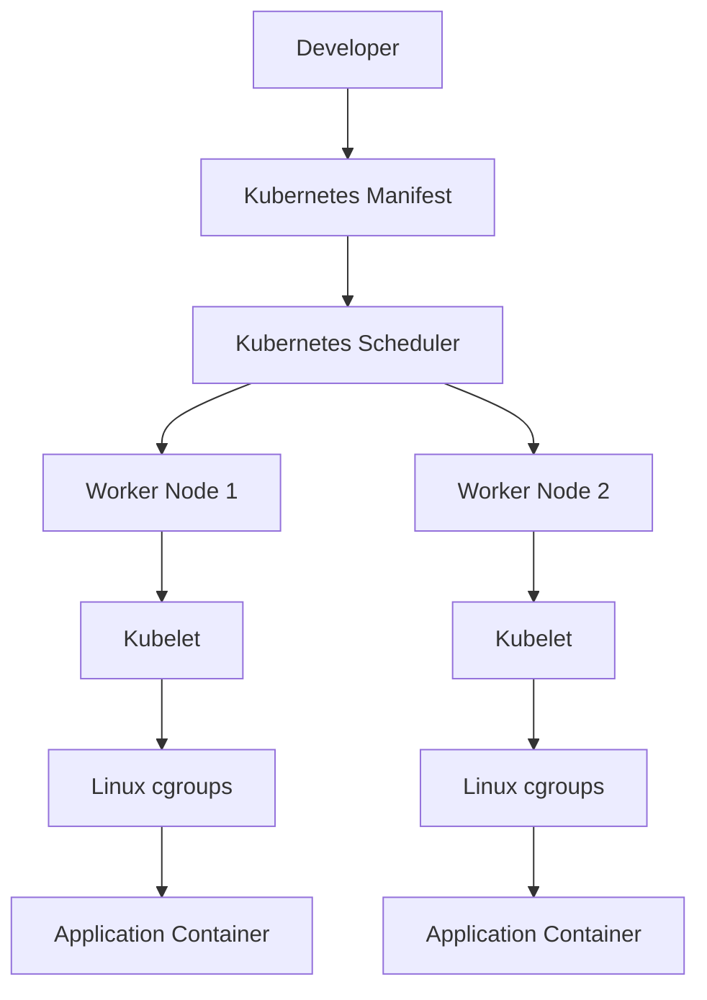
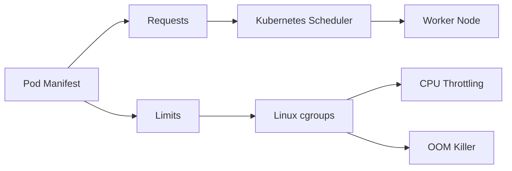
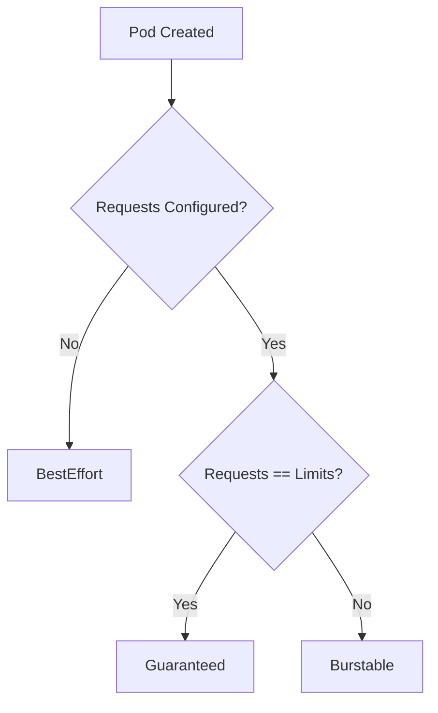
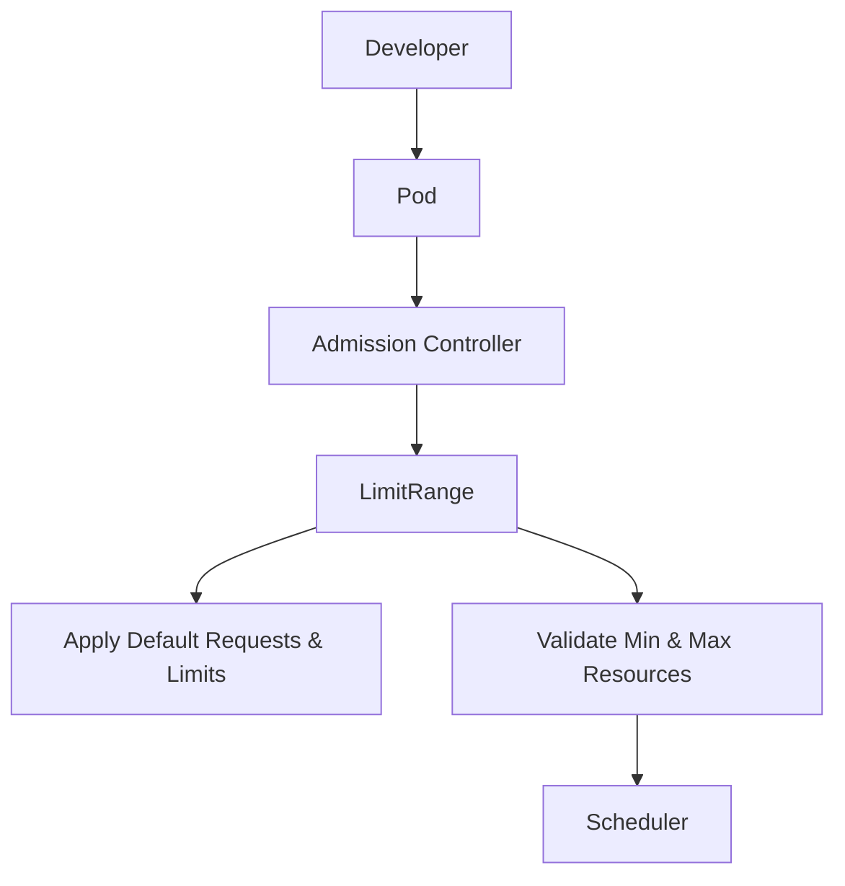
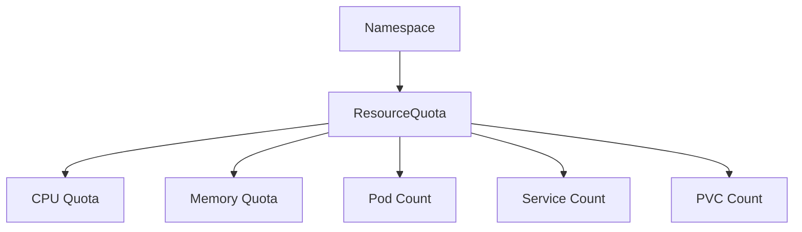
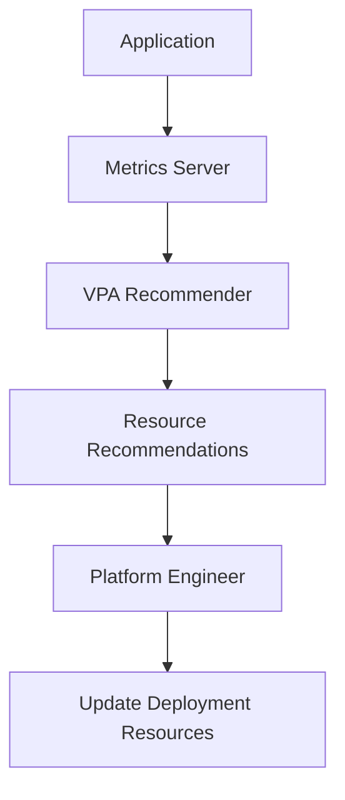

# ⚙️ Kubernetes Resource Management — Requests, Limits, QoS, LimitRange, ResourceQuota & VPA


A pod without correctly configured resources is either wasting capacity or one memory spike away from an `OOMKilled` event. This project walks through the full resource-management stack in Kubernetes — from what the scheduler sees, to what the kubelet enforces, down to the Linux cgroups doing the actual throttling — and closes the loop with VPA-driven right-sizing based on real usage data.

## 🏗️ Architecture



### Resource Flow: Requests vs Limits



---

## ⚖️ Requests vs Limits

| Feature | Requests | Limits |
|---|:---:|:---:|
| Used by Scheduler | ✅ | ❌ |
| Used by Linux cgroups | ❌ | ✅ |
| Reserves Resources | ✅ | ❌ |
| Triggers CPU Throttling | ❌ | ✅ |
| Enforces Memory Ceiling | ❌ | ✅ |

---


## 🧭 Kubernetes QoS Classes




Creating a EKS cluster

bash
```
eksctl create cluster \
  --name resource-management-lab \
  --region us-east-1 \
  --version 1.33 \
  --nodegroup-name workers \
  --node-type t3.medium \
  --nodes 2 \
  --managed
```

verify 


install metric server and check the node resources


lets describe nodes and check the allocatable storage

bash
```
kubectl describe node ip-192-168-1-113.ec2.internal
```


Scheduler uses Allocatable, not Capacity.

Allocated resources


This section represents the sum of all pod resource requests scheduled on the node.

# Deploy a Pod with No Requests or Limits

bash
```
apiVersion: apps/v1
kind: Deployment

metadata:
  name: nginx-no-resources

spec:
  replicas: 1

  selector:
    matchLabels:
      app: nginx

  template:
    metadata:
      labels:
        app: nginx

    spec:
      containers:
      - name: nginx
        image: nginx:latest
```


descibe the pod to check resources

bash
```
kubectl get pods

kubectl describe pod <pod-name>

```


No requests or limits then

The scheduler did not reserve any CPU.
The scheduler did not reserve any memory.
The container can use resources  until it encounters contention or system limits.

Imagine this node has:

2 CPU

4 GB RAM

Now imagine deploying 500 pods like this.

Every deployment has:

resources:

(empty)

The scheduler sees:

Pod 1

Needs

0 CPU

0 Memory

✔ Fits

----------------

Pod 2

Needs

0 CPU

0 Memory

✔ Fits

----------------

Pod 3

Needs

0 CPU

0 Memory

✔ Fits

Eventually:

500 Pods

Actual Memory

12GB

On a node with only 4GB RAM.

The scheduler didn't make a mistake—it scheduled based on what the pods declared.

When memory runs out:

Linux OOM Killer

↓

Kills containers

↓

Pods restart

↓

Applications become unavailable

This is why production clusters should never run workloads without resource requests.

# Resource Requests

                 Deployment
                      │
                      ▼
         CPU Request: 250m
      Memory Request: 128Mi
                      │
                      ▼
        Kubernetes Scheduler
                      │
                      ▼
      Finds a node with enough
      allocatable resources
                      │
                      ▼
               Pod Scheduled


   Creating a deployment with resource requests

   bash
   ```
   apiVersion: apps/v1
kind: Deployment

metadata:
  name: nginx-request

spec:
  replicas: 1

  selector:
    matchLabels:
      app: nginx-request

  template:
    metadata:
      labels:
        app: nginx-request

    spec:
      containers:
      - name: nginx

        image: nginx:latest

        resources:
          requests:
            cpu: "250m"
            memory: "128Mi"
   ```
Notice that we only define requests.

There are no limits yet.

   deploy -- verfiy -- describe

   


   we can observed that the QOS is chnaged to burstable

   Describe the node

   bash
   ```
 kubectl describe node ip-192-168-36-163.ec2.internal
   ```


Your pod has now reserved these resources on the node.

This reservation exists even if the pod is idle.

compare the actual usage with requested 


The request is not how much the pod is using.

It is how much the scheduler reserves so that the pod has guaranteed access if it needs it.

# Resource Limits

bash
```
                    Deployment
                         │
                         ▼
              Requests and Limits
                         │
                         ▼
          Kubernetes Scheduler (Requests)
                         │
                         ▼
                Pod Scheduled to Node
                         │
                         ▼
                  kubelet on the Node
                         │
                         ▼
                 Linux cgroups Created
                  ┌───────────────┐
                  │ CPU Controller│
                  │ Memory Ctrl   │
                  └───────────────┘
                         │
          ┌──────────────┴──────────────┐
          │                             │
          ▼                             ▼
   CPU > Limit?                  Memory > Limit?
          │                             │
          ▼                             ▼
   CPU Throttled                 OOMKilled
   ```
   
Limits

Used by:

Linux Kernel (cgroups)

Purpose:

Prevent containers from exceeding configured limits

creating a deployment with limits
   
bash
```
apiVersion: apps/v1
kind: Deployment

metadata:
  name: nginx-limits

spec:
  replicas: 1

  selector:
    matchLabels:
      app: nginx-limits

  template:
    metadata:
      labels:
        app: nginx-limits

    spec:
      containers:
      - name: nginx
        image: nginx:latest

        resources:

          requests:
            cpu: "250m"
            memory: "128Mi"

          limits:
            cpu: "500m"
            memory: "256Mi"
```


The container is guaranteed 250m CPU and 128Mi memory, but it may burst up to 500m CPU and 256Mi memory.

Also note the QoS class. It should now be Burstable, because the pod has requests and limits, but they are not equal.

CPU is compressible.

If the application wants:

800m CPU

but the limit is:

500m

the kernel doesn't kill the process.

Instead:

800m Requested

↓

500m Allowed

↓

300m Denied

↓

CPU Throttling

The application continues running, just more slowly.


Memory is not compressible.

Suppose the application tries to allocate:

400Mi

while the limit is:

256Mi

Then:

Application

↓

Allocates 400Mi

↓

Kernel detects limit exceeded

↓

OOM Killer

↓

Container terminated

↓

Pod restarts (depending on restart policy)

Unlike CPU, memory cannot simply be slowed down.


# Kubernetes QoS (Quality of Service)

Every time a Pod is created, Kubernetes automatically assigns a QoS class.

You never specify it manually.

The decision is based entirely on the pod's requests and limits.

bash
```
             Pod Created
                  │
                  ▼
       Does it have Requests?
                  │
          ┌───────┴────────┐
          │                │
         No               Yes
          │                │
          ▼                ▼
    BestEffort     Are Requests == Limits?
                           │
                  ┌────────┴────────┐
                  │                 │
                 Yes               No
                  │                 │
                  ▼                 ▼
            Guaranteed         Burstable
```

1. BestEffort Pod

bash
```
apiVersion: v1
kind: Pod

metadata:
  name: besteffort

spec:
  containers:
  - name: nginx
    image: nginx:latest
```
deploy and describe 


2. Burstable Pod

bash
```
apiVersion: v1
kind: Pod

metadata:
  name: burstable

spec:
  containers:
  - name: nginx
    image: nginx:latest

    resources:
      requests:
        cpu: "250m"
        memory: "128Mi"

      limits:
        cpu: "500m"
        memory: "256Mi"
```
deploy and describe


requests a dn limits are set but there not equal


3. Guaranteed Pod

bash
```
apiVersion: v1
kind: Pod

metadata:
  name: guaranteed

spec:
  containers:
  - name: nginx
    image: nginx:latest

    resources:
      requests:
        cpu: "250m"
        memory: "128Mi"

      limits:
        cpu: "250m"
        memory: "128Mi"
```


Request CPU = Limit CPU

Request Memory = Limit Memory


why QoS 

Suppose your node has:

Memory Available

4 GB

Your workloads consume:

4.3 GB

The node is under memory pressure.

Kubernetes must free memory.

It doesn't choose randomly.

It follows QoS.


E<details>
<summary><b>QoS Eviction Priority (click to expand)</b></summary>

| Priority | QoS Class | Eviction Order |
|:---:|---|---|
| 1 | BestEffort | First (evicted under pressure) |
| 2 | Burstable | Second |
| 3 | Guaranteed | Last (most protected) |

</details>

# LimitRange

Imagine a team deploys this pod:

resources:

Nothing.

Kubernetes will create the pod.

QoS:

BestEffort

Now imagine another developer deploys:

resources:
  requests:
    memory: 64Gi

If your node only has 8 GiB of RAM, that pod can never be scheduled and may cause confusion or waste.

A LimitRange helps prevent both situations by enforcing sensible defaults and boundaries.

bash
```
                Developer
                     │
                     ▼
             Deploys a Pod
                     │
                     ▼
          Admission Controller
                     │
                     ▼
              Namespace LimitRange
                     │
         ┌───────────┴────────────┐
         │                        │
   Missing resources?      Outside allowed range?
         │                        │
         ▼                        ▼
 Add default values         Reject the Pod
```

## 🛡️ Namespace Governance

<details>
<summary><b>LimitRange Architecture</b></summary>



</details>

<details>
<summary><b>ResourceQuota Architecture</b></summary>



</details>
create a namspace 

bash
```
kubectl create namespace resource-demo
```

creating a limit range for namespace

bash
```
apiVersion: v1
kind: LimitRange

metadata:
  name: resource-limits
  namespace: resource-demo

spec:
  limits:
  - type: Container

    default:
      cpu: "500m"
      memory: "512Mi"

    defaultRequest:
      cpu: "250m"
      memory: "256Mi"

    min:
      cpu: "100m"
      memory: "128Mi"

    max:
      cpu: "1"
      memory: "1Gi"
```


lets test limit range by deploying the pod without resources

bash
```
apiVersion: v1
kind: Pod

metadata:
  name: nginx-default
  namespace: resource-demo

spec:
  containers:
  - name: nginx
    image: nginx:latest
```

deploy and inspect the pod 

bash
```
kubectl describe pod nginx-default -n resource-demo
```


The LimitRange automatically added them during admission.

testing Min constraint

bash
```
apiVersion: v1
kind: Pod

metadata:
  name: below-min
  namespace: resource-demo

spec:
  containers:
  - name: nginx
    image: nginx:latest

    resources:
      requests:
        cpu: "50m"
        memory: "64Mi"
```


Max constraint

bash
```
apiVersion: v1
kind: Pod

metadata:
  name: above-max
  namespace: resource-demo

spec:
  containers:
  - name: nginx
    image: nginx:latest

    resources:
      limits:
        cpu: "2"
        memory: "2Gi"
```


The configured limits exceed the namespace maximum.

# ResourceQuota

          Kubernetes Cluster
                           │
        ┌──────────────────┴──────────────────┐
        │                                     │
        ▼                                     ▼
   Namespace A                          Namespace B
      Team A                               Team B
        │                                     │
        ▼                                     ▼
    LimitRange                         LimitRange
        │                                     │
        ▼                                     ▼
   ResourceQuota                     ResourceQuota
        │                                     │
        ▼                                     ▼
      Pods                                Pods

The scheduler works at the cluster level, but ResourceQuota is enforced before scheduling, during the API admission process.


creating a resource quota

bash
```
apiVersion: v1
kind: ResourceQuota

metadata:
  name: team-quota
  namespace: quota-demo

spec:
  hard:
    requests.cpu: "1"
    requests.memory: 1Gi

    limits.cpu: "2"
    limits.memory: 2Gi

    pods: "5"

    services: "3"

    persistentvolumeclaims: "2"
```
Notice these are totals across the namespace, not per pod.

Verify and describe

bash
```
kubectl get resourcequota -n quota-demo

kubectl describe resourcequota team-quota -n quota-demo
```


Zero usage as of now

Deploying a pod

bash
```
apiVersion: v1
kind: Pod

metadata:
  name: nginx-1
  namespace: quota-demo

spec:
  containers:
  - name: nginx
    image: nginx:latest

    resources:
      requests:
        cpu: "250m"
        memory: "256Mi"

      limits:
        cpu: "500m"
        memory: "512Mi"

```

deploy and describe the resouce quota now


### Scale Until the Quota is Hit

bash
```
apiVersion: apps/v1
kind: Deployment

metadata:
  name: nginx
  namespace: quota-demo

spec:
  replicas: 4

  selector:
    matchLabels:
      app: nginx

  template:
    metadata:
      labels:
        app: nginx

    spec:
      containers:
      - name: nginx
        image: nginx:latest

        resources:
          requests:
            cpu: "250m"
            memory: "256Mi"

          limits:
            cpu: "500m"
            memory: "512Mi"
```

Each replica requests:

CPU: 250m
Memory: 256Mi

Four replicas consume:

CPU Requests = 1 CPU
Memory Requests = 1 GiB

This exactly matches the namespace quota.


Exceeding the Quota

bash
```
kubectl scale deployment nginx \
  --replicas=5 \
  -n quota-demo
```

describe the quota and events


Without ResourceQuota, one team could accidentally deploy hundreds of pods and consume all cluster resources.

With ResourceQuota, each team stays within its allocated budget.

# Vertical Pod Autoscaler (VPA)

Kubernetes automatically recommends the right CPU and memory requests based on actual usage.

  Application
                       │
                       ▼
                CPU / Memory Usage
                       │
                       ▼
                Metrics Server
                       │
                       ▼
               VPA Recommender
                       │
          Analyzes historical usage
                       │
                       ▼
             Recommended Resources
                       │
              ┌────────┴────────┐
              │                 │
          Recommendation     Auto Update

          
## 📈 Vertical Pod Autoscaler (VPA)




verify the metric server
  bash
  ```
kubectl top nodes

kubectl top pods -A
  ```

 # Install Vertical Pod Autoscaler

 bash
 ```
 git clone https://github.com/kubernetes/autoscaler.git

cd autoscaler/vertical-pod-autoscaler

./hack/vpa-up.sh
 ```

 


 verfiy the installation

 

 bash
 ```
apiVersion: apps/v1
kind: Deployment

metadata:
  name: stress-app

spec:
  replicas: 1

  selector:
    matchLabels:
      app: stress-app

  template:
    metadata:
      labels:
        app: stress-app

    spec:
      containers:
      - name: stress

        image: polinux/stress

        args:
        - "--cpu"
        - "2"
        - "--vm"
        - "1"
        - "--vm-bytes"
        - "256M"

        resources:
          requests:
            cpu: "100m"
            memory: "64Mi"

          limits:
            cpu: "1000m"
            memory: "512Mi"

   ```

   create a VPA

   bash
   ```
   apiVersion: autoscaling.k8s.io/v1
kind: VerticalPodAutoscaler

metadata:
  name: nginx-vpa

spec:
  targetRef:
    apiVersion: apps/v1
    kind: Deployment
    name: nginx-vpa

  updatePolicy:
    updateMode: "Off"

   ```

After creating vpa and deployment then wait for 10-15 mins to get recommendations from vpa by describing it

bash
```
kubectl describe vpa stress-app-vpa
```


# Resource Right-Sizing

based on the vpa recommendations

### Real Recommendation Output

| Resource | Initial Request | VPA Recommendation | Delta |
|---|---:|---:|---:|
| CPU | 100m | 1168m | ~11.7x |
| Memory | 64Mi | ~283Mi | ~4.4x |

This is the gap between a "guessed" request and what the workload actually needs under real load — exactly what VPA is built to surface before it costs you an outage or a wasted node.


lets create a deployment

bash
```
apiVersion: apps/v1
kind: Deployment

metadata:
  name: stress-app-optimized

spec:
  replicas: 1

  selector:
    matchLabels:
      app: stress-app-optimized

  template:
    metadata:
      labels:
        app: stress-app-optimized

    spec:
      containers:
      - name: stress

        image: polinux/stress

        command:
        - stress

        args:
        - "--cpu"
        - "2"
        - "--vm"
        - "1"
        - "--vm-bytes"
        - "256M"
        - "--timeout"
        - "600"

        resources:
          requests:
            cpu: "1200m"
            memory: "300Mi"

          limits:
            cpu: "2"
            memory: "512Mi"
```
verify the resources

bash
```
kubectl top pod
```


   
## 🔑 Key Learnings

- The Kubernetes **Scheduler** places pods based on **Requests**, never Limits.
- **Linux cgroups**, not the scheduler, enforce Limits at runtime.
- Exceeding a CPU limit → **throttling**. Exceeding a memory limit → **OOMKilled**.
- **QoS class** (Guaranteed / Burstable / BestEffort) determines eviction order under node pressure.
- **LimitRange** enforces namespace-wide default, minimum, and maximum resource values.
- **ResourceQuota** caps total resource consumption per namespace — essential for multi-tenant clusters.
- **VPA** recommends right-sized requests from actual historical usage, not guesswork.

## 🏭 Production Best Practices

- Always define CPU and Memory Requests — never ship a BestEffort pod for a critical service.
- Configure Limits for every production workload.
- Use LimitRange to enforce sane namespace-wide defaults.
- Use ResourceQuota in every multi-tenant cluster.
- Run VPA in **recommendation mode** first — never auto-apply blind.
- Review VPA recommendations on a regular cadence to control cost and prevent drift.
- Continuously monitor real workload utilization, not just configured requests/limits.

   
## 🏁 Outcome

An end-to-end walkthrough of Kubernetes resource management — from scheduling, to cgroup-level enforcement, to namespace governance, to automated right-sizing with VPA. The kind of resource-tuning workflow that separates a cluster that *works* from one that's actually **production-ready**.
