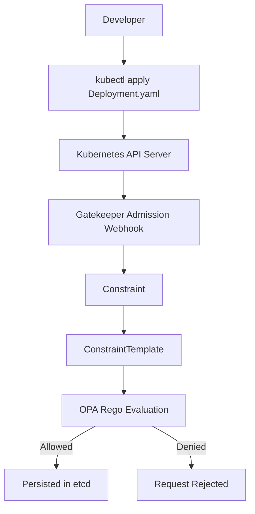

# Day 11 - OPA Gatekeeper Policy-as-Code on Amazon EKS


It provides admission control policies that enforce security, governance, and operational best practices before workloads are deployed into the cluster.

The objective is to shift Kubernetes governance left — validating resources at deployment time and preventing misconfigured workloads from ever entering production environments.

## Architecture



 # phase 1 creating EKS cluster

 bash
 ```
 apiVersion: eksctl.io/v1alpha5
kind: ClusterConfig

metadata:
  name: opa-gatekeeper-lab
  region: us-east-1
  version: "1.33"

managedNodeGroups:

  - name: workers

    instanceType: t3.medium

    desiredCapacity: 2

    minSize: 2

    maxSize: 3

    volumeSize: 20
 ```

 bash
 ```
 eksctl create cluster -f eks-cluster.yaml
 ```

 verify eks

 

 # Phase 2 Install gatekeeper

 add Helm repos
 bash
 ```
 helm repo add gatekeeper https://open-policy-agent.github.io/gatekeeper/charts

helm repo update
 ```

Install gatekeeper
bash
```
helm install gatekeeper gatekeeper/gatekeeper \
-n gatekeeper-system \
--create-namespace
```

verify gatekeeper 


verify webhook


# phase 3 Test policies

bash
```
apiVersion: templates.gatekeeper.sh/v1
kind: ConstraintTemplate

metadata:
  name: k8sdisallowlatest

spec:
  crd:
    spec:
      names:
        kind: K8sDisallowLatest

  targets:
    - target: admission.k8s.gatekeeper.sh

      rego: |
        package k8sdisallowlatest

        violation[{"msg": msg}] {

          input.review.kind.kind == "Deployment"

          container := input.review.object.spec.template.spec.containers[_]

          endswith(container.image, ":latest")

          msg := sprintf(
            "Container '%v' uses forbidden tag latest",
            [container.name]
          )

        }
```

deploy and verify them


create a deployment which violates the policy

bash
```
apiVersion: apps/v1
kind: Deployment

metadata:
  name: nginx-latest

spec:
  replicas: 1

  selector:
    matchLabels:
      app: nginx

  template:
    metadata:
      labels:
        app: nginx

    spec:
      containers:

      - name: nginx

        image: nginx:latest

        ports:

        - containerPort: 80
```
Here you go about violation by gatekeeper


Postive test

bash
```
apiVersion: apps/v1
kind: Deployment

metadata:
  name: nginx-good

spec:
  replicas: 1

  selector:
    matchLabels:
      app: nginx

  template:

    metadata:

      labels:

        app: nginx

    spec:

      containers:

      - name: nginx

        image: nginx:1.29

        ports:

        - containerPort: 80
```
created without latest Tag


Policy #2 — Required Labels

create a constraint Template and constraint

bash
```
apiVersion: templates.gatekeeper.sh/v1
kind: ConstraintTemplate

metadata:
  name: k8srequiredlabels

spec:
  crd:
    spec:
      names:
        kind: K8sRequiredLabels

      validation:
        openAPIV3Schema:
          type: object
          properties:
            labels:
              type: array
              items:
                type: string

  targets:
  - target: admission.k8s.gatekeeper.sh

    rego: |
      package k8srequiredlabels

      violation[{"msg": msg}] {

        required := input.parameters.labels[_]

        not input.review.object.metadata.labels[required]

        msg := sprintf(
          "Missing required label: %v",
          [required]
        )

      }
```

constraint
bash
```
apiVersion: constraints.gatekeeper.sh/v1beta1
kind: K8sRequiredLabels

metadata:
  name: required-labels

spec:

  match:
    kinds:
      - apiGroups:
          - apps
        kinds:
          - Deployment

  parameters:
    labels:
      - owner
      - team
      - environment
      - application
```

deploy and verify


creating a deployment without labels

bash
```
apiVersion: apps/v1
kind: Deployment

metadata:
  name: bad-app

  labels:
    owner: devops

spec:
  replicas: 1

  selector:
    matchLabels:
      app: bad-app

  template:
    metadata:
      labels:
        app: bad-app

    spec:
      containers:
      - name: nginx
        image: nginx:1.29
```
violating no labels


Policy #3 — Resource Requests & Limits Required

create Constraint Template and Constraint

bash
```
apiVersion: templates.gatekeeper.sh/v1
kind: ConstraintTemplate

metadata:
  name: k8srequiredresources

spec:
  crd:
    spec:
      names:
        kind: K8sRequiredResources

  targets:
  - target: admission.k8s.gatekeeper.sh

    rego: |
      package k8srequiredresources

      violation[{"msg": msg}] {

        container := input.review.object.spec.template.spec.containers[_]

        not container.resources.requests.cpu

        msg := sprintf(
          "Container '%v' missing cpu request",
          [container.name]
        )

      }

      violation[{"msg": msg}] {

        container := input.review.object.spec.template.spec.containers[_]

        not container.resources.requests.memory

        msg := sprintf(
          "Container '%v' missing memory request",
          [container.name]
        )

      }

      violation[{"msg": msg}] {

        container := input.review.object.spec.template.spec.containers[_]

        not container.resources.limits.cpu

        msg := sprintf(
          "Container '%v' missing cpu limit",
          [container.name]
        )

      }

      violation[{"msg": msg}] {

        container := input.review.object.spec.template.spec.containers[_]

        not container.resources.limits.memory

        msg := sprintf(
          "Container '%v' missing memory limit",
          [container.name]
        )

      }
```

Constarint

bash
```
apiVersion: constraints.gatekeeper.sh/v1beta1
kind: K8sRequiredResources

metadata:
  name: required-resources

spec:

  match:

    kinds:
      - apiGroups:
          - apps
        kinds:
          - Deployment
```


create a deployment

bash
```
apiVersion: apps/v1
kind: Deployment

metadata:
  name: bad-resource-app

spec:
  replicas: 1

  selector:
    matchLabels:
      app: bad-resource-app

  template:
    metadata:
      labels:
        app: bad-resource-app

    spec:
      containers:
      - name: nginx

        image: nginx:1.29
```


# Policy 4 — Block Privileged Containers
Objective

Reject workloads that specify:

securityContext:
  privileged: true

This prevents containers from gaining host-level privileges.

create Constarint template and constraint


verify by creating a deployment

bash
```
apiVersion: apps/v1
kind: Deployment

metadata:
  name: privileged-app

spec:
  replicas: 1

  selector:
    matchLabels:
      app: privileged-app

  template:
    metadata:
      labels:
        app: privileged-app

    spec:
      containers:

      - name: nginx

        image: nginx:1.29

        securityContext:
          privileged: true
```


# Policy 5 — Allowed Registries
Objective

Only allow images from approved registries.

similairly for every policy create a Constarint template and constraint


## Security Benefits

This implementation provides:

- Admission control
- Immutable deployments
- Runtime hardening
- Supply chain protection
- Governance enforcement
- Standardized Kubernetes configurations
- Multi-team cluster compliance

---

---

## Key Learnings

- Kubernetes admission controllers
- OPA Gatekeeper architecture
- ConstraintTemplates
- Constraints
- Rego policy development
- Kubernetes security best practices
- Policy-as-Code
- Supply chain security
- Cluster governance
- Enterprise Kubernetes compliance

---

Planned extensions to broaden policy coverage across pod security, networking, and resource governance:

| # | Policy | Objective |
|---|--------|-----------|
| 6 | Run as Non-Root | Block containers from running as UID 0 |
| 7 | Read-Only Root Filesystem | Require `readOnlyRootFilesystem: true` to prevent runtime tampering |
| 8 | Seccomp Required | Enforce a seccomp profile (e.g. `RuntimeDefault`) on all pods |
| 9 | Drop Capabilities | Require containers to drop all Linux capabilities by default |
| 10 | Image Digest Required | Require images to be pinned by digest (`@sha256:...`) instead of tag |
| 11 | HostNetwork Block | Deny pods requesting `hostNetwork: true` |
| 12 | HostPID Block | Deny pods requesting `hostPID: true` |
| 13 | HostIPC Block | Deny pods requesting `hostIPC: true` |
| 14 | Require Probes | Require `livenessProbe` and `readinessProbe` on all containers |
| 15 | Require NetworkPolicies | Ensure every namespace has at least one NetworkPolicy defined |
| 16 | Namespace Restrictions | Restrict workload deployment to approved namespaces only |
| 17 | StorageClass Restrictions | Allow only approved StorageClasses for PVCs |
| 18 | ServiceAccount Enforcement | Block use of the default ServiceAccount; require explicit SA |
| 19 | Non-Root User IDs | Enforce a minimum/allowed UID range (e.g. UID > 1000) |
| 20 | Capability Restrictions | Allow only an explicit, approved list of Linux capabilities |

Successfully implemented a production-style Policy-as-Code framework on Amazon EKS using OPA Gatekeeper, with security, governance, and compliance controls enforced at admission time.


