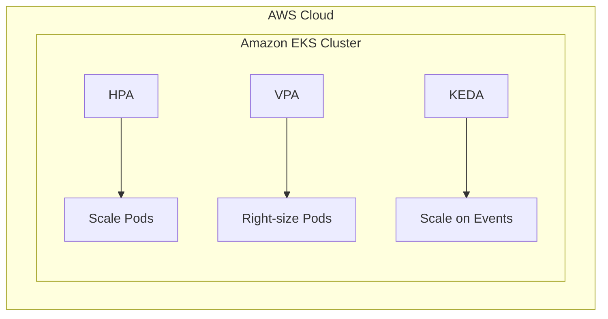
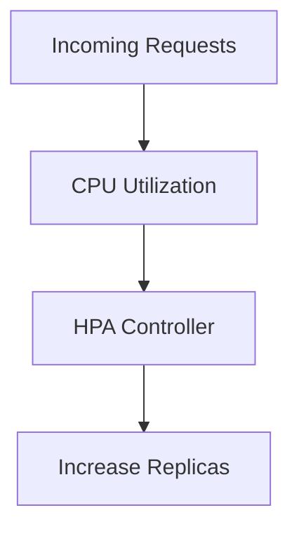
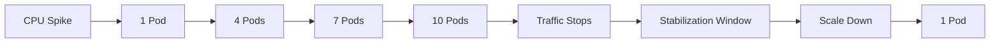
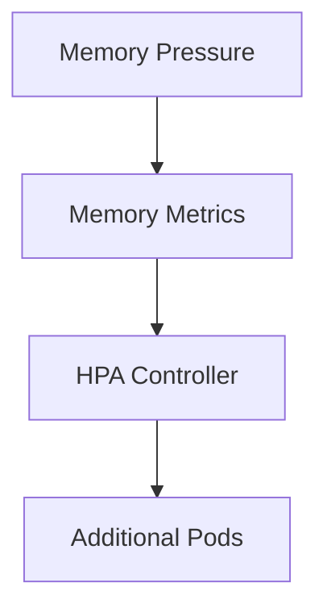
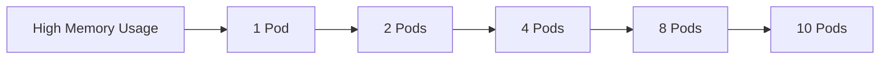
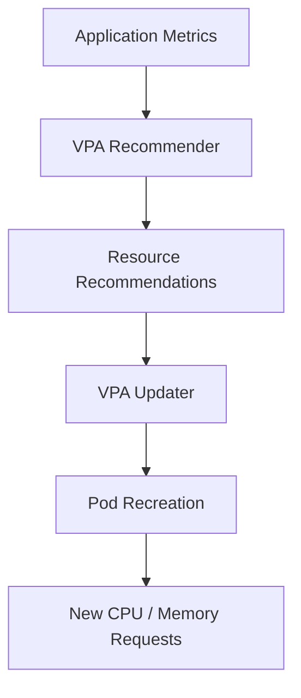
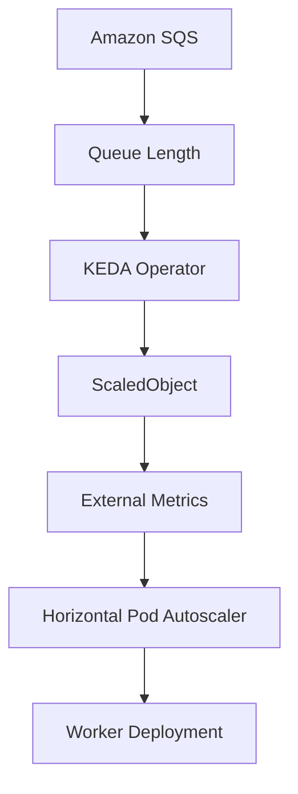
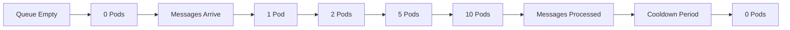

# Day 7 - Kubernetes Intelligent Autoscaling Lab

**HPA • VPA • KEDA with Amazon SQS on AWS EKS**




# project structure 


## Phase 0 setup kubectl,eksctl,awscli,aws configure

## Phase 1 - Creating a EKS Cluster

bash
```
  eksctl create cluster \
--name autoscaling-lab \
--region us-east-1 \
--nodes 2 \
--node-type t3.medium
```

wait for 20 mins to  EKS create a cluster


Now EKS cluster is ready


# Phase 2 — Metrics Server

  bash
  ```
  kubectl apply -f \
https://github.com/kubernetes-sigs/metrics-server/releases/latest/download/components.yaml
   ```

  kubectl get pods -n kube-system
  
   

  

  If find similair issue then edit metric server
  
  bash
  ```
  kubectl edit deployment metrics-server -n kube-system
  ```
  add these lines
  bash 
  ```
   - --kubelet-insecure-tls
   - --kubelet-preferred-address-types=InternalIP
   ```
   Restart metric server
   
  bash
  ```
   kubectl rollout restart deployment metrics-server -n kube-system
   ```
   Check endpoints are there are not
   
   

   
   kubectl create namespace autoscaling

  kubectl get ns

# Phase 3  - HPA CPU

# HPA — CPU Autoscaling

Horizontal Pod Autoscaler adjusts the number of pod replicas according to CPU utilization.

### Scaling Logic




create deployment

bash
```
apiVersion: apps/v1
kind: Deployment

metadata:
  name: hpa-demo
  namespace: autoscaling

spec:
  replicas: 1

  selector:
    matchLabels:
      app: hpa-demo

  template:

    metadata:
      labels:
        app: hpa-demo

    spec:

      containers:

      - name: php-apache

        image: registry.k8s.io/hpa-example

        ports:

        - containerPort: 80

        resources:

          requests:
            cpu: 200m

          limits:
            cpu: 500m
```

  create service

  bash
  ```
apiVersion: v1
kind: Service

metadata:
  name: hpa-demo
  namespace: autoscaling

spec:

  selector:
    app: hpa-demo

  ports:

  - port: 80

    targetPort: 80
  ```

create HPA
  bash
  ```
  apiVersion: autoscaling/v2

kind: HorizontalPodAutoscaler

metadata:
  name: hpa-demo
  namespace: autoscaling

spec:

  scaleTargetRef:

    apiVersion: apps/v1

    kind: Deployment

    name: hpa-demo

  minReplicas: 1

  maxReplicas: 10

  metrics:

  - type: Resource

    resource:

      name: cpu

      target:

        type: Utilization

        averageUtilization: 50
  ```
Deploy them
  

 Verify then
 

 seems everthings works fine then Start load generator

 bash
 ```
 kubectl run load-generator \
-n autoscaling \
--rm -it \
--image=busybox \
-- /bin/sh
```

enter this command inside container which will increase cpu


Autoscaling based on the CPU load


check no of pods coming up


Now teriminating the container with load Hpa will scale down after cooling period of 300 seconds(5 minutes).

 


 
### Observed Behaviour




 # Phase 4 HPA Memory

 ## HPA — Memory Autoscaling

Memory-based HPA adjusts replicas according to memory consumption.

### Scaling Logic



  Create a  deployment.yaml

  bash
  ```
  apiVersion: apps/v1
kind: Deployment

metadata:
  name: memory-demo
  namespace: autoscaling

spec:
  replicas: 1

  selector:
    matchLabels:
      app: memory-demo

  template:

    metadata:
      labels:
        app: memory-demo

    spec:

      containers:

      - name: memory-demo

        image: polinux/stress

        command:
        - stress

        args:
        - "--vm"
        - "1"
        - "--vm-bytes"
        - "150M"
        - "--vm-hang"
        - "1"

        resources:

          requests:
            memory: 100Mi
            cpu: 100m

          limits:
            memory: 300Mi
            cpu: 500m
  ```

create Hpa for memory

bash
```
apiVersion: autoscaling/v2
kind: HorizontalPodAutoscaler

metadata:
  name: memory-demo
  namespace: autoscaling

spec:

  scaleTargetRef:

    apiVersion: apps/v1

    kind: Deployment

    name: memory-demo

  minReplicas: 1

  maxReplicas: 10

  metrics:

  - type: Resource

    resource:

      name: memory

      target:

        type: Utilization

        averageUtilization: 70
```

Deploy them

bash 
```
kubectl apply -f deployment.yaml

kubectl apply -f hpa-memory.yaml
```
Verify them


Now scaling automatically triggers because deployment containers already have memory intensive task


### Observed Behaviour




# Phase  5 VPA

## Vertical Pod Autoscaler (VPA)

VPA dynamically recommends and adjusts resource requests based on observed workload consumption.

> Unlike HPA, VPA does **not** increase pod count — it optimizes resource allocation per pod.

### VPA Flow




Clone autoscaler repo

bash
```
git clone https://github.com/kubernetes/autoscaler.git
```
bash
```
Move to cd autoscaler/vertical-pod-autoscaler
```

Install VPA
bash
```
./hack/vpa-up.sh
```


Verify VPA setup


create a deployment
bash
```
apiVersion: apps/v1
kind: Deployment

metadata:
  name: vpa-demo
  namespace: autoscaling

spec:
  replicas: 1

  selector:
    matchLabels:
      app: vpa-demo

  template:

    metadata:
      labels:
        app: vpa-demo

    spec:

      containers:

      - name: stress

        image: polinux/stress

        command:

        - stress

        args:

        - "--vm"

        - "1"

        - "--vm-bytes"

        - "200M"

        - "--vm-hang"

        - "1"

        resources:

          requests:

            cpu: 100m

            memory: 100Mi

          limits:

            cpu: 500m

            memory: 500Mi
```

create VPA

bash
```
apiVersion: autoscaling.k8s.io/v1

kind: VerticalPodAutoscaler

metadata:
  name: vpa-demo

  namespace: autoscaling

spec:

  targetRef:

    apiVersion: apps/v1

    kind: Deployment

    name: vpa-demo

  updatePolicy:

    updateMode: Auto
```

deploy them

bash 
```
kubectl apply -f deployment.yaml

kubectl apply -f vpa.yaml
```
then verify VPA


VPA recommendations


check current one replica and their resource requests will adjusted by VPA


# Phase 6 KEDA Installation

### KEDA Architecture



  Adding Helm repo and update

  bash
  ```
  helm repo add kedacore \
https://kedacore.github.io/charts

helm repo update
  ```

  Install KEDA using Helm
  bash
  ```
  helm install keda kedacore/keda \
--namespace keda \
--create-namespace
  ```

  


  Verify installation

  bash
  ```
  kubectl get pods -n keda
  ```

 

 verify CRDS and operators

 

 

external metrics

bash
```
kubectl get apiservice | grep external.metrics
```


# KEDA enables event-driven autoscaling.

Unlike HPA, KEDA supports:

SQS

Kafka

RabbitMQ

Redis

Prometheus

Azure Service Bus

AWS CloudWatch

Custom external metrics

KEDA also supports scale-to-zero.


creating a queue 

bash
```
aws sqs create-queue \
--queue-name autoscaling
```


get Queue Url and Queue arn

bash
```
aws sqs get-queue-url \
--queue-name autoscaling
```

verify 


## Scale-to-Zero

One of the most important capabilities demonstrated in this project is **scale-to-zero**.

Traditional HPA maintains at least one running pod. KEDA allows workloads to completely stop when no work is available.

### Behaviour




# Phase 7 IRSA


Associate OICD provider

bash 
```
eksctl utils associate-iam-oidc-provider \
--cluster autoscaling-lab \
--approve
```


Verify OIDC

bash
```
aws eks describe-cluster \
--name autoscaling-lab \
--query cluster.identity.oidc.issuer
```


create a JSOn policy to get permission for EKS to access SQS

bash
```
{
 "Version":"2012-10-17",

 "Statement":[

 {

 "Effect":"Allow",

 "Action":[

 "sqs:GetQueueAttributes",

 "sqs:GetQueueUrl",

 "sqs:ReceiveMessage"

 ],

 "Resource":"*"

 }

 ]

}
```

create a IAM POLICY 

bash
```
aws iam create-policy \
--policy-name KEDA-SQS \
--policy-document file://policy.json
```


list polices


Create IRSA(IAM service Account)

bash
```
eksctl create iamserviceaccount \
  --cluster autoscaling-lab \
  --namespace keda \
  --name keda-operator \
  --attach-policy-arn arn:aws:iam::497508796460:policy/KEDA-SQS \
  --override-existing-serviceaccounts \
  --approve
```
verify  role created


Restart KEDA and check rollout status

bash
```
kubectl rollout restart deployment keda-operator -n keda

kubectl rollout status deployment keda-operator -n keda
```

Verify IRSA


# Phase 8 Worker node and KEDA scaled object

create worker deployment

bash
```
apiVersion: apps/v1
kind: Deployment

metadata:
  name: worker
  namespace: autoscaling

spec:
  replicas: 0

  selector:
    matchLabels:
      app: worker

  template:

    metadata:
      labels:
        app: worker

    spec:

      containers:

      - name: worker

        image: busybox

        command:
        - sh
        - -c

        args:
        - |
          while true
          do
            echo "processing"
            sleep 30
          done
```

deploy and verify


create triggerauth and 

  bash
  ```
  apiVersion: keda.sh/v1alpha1
kind: TriggerAuthentication

metadata:
  name: aws-trigger-auth
  namespace: autoscaling

spec:
  podIdentity:
    provider: aws
  ```

  create scaledobject

  bash
  ```
  apiVersion: keda.sh/v1alpha1
kind: ScaledObject

metadata:
  name: sqs-scaler
  namespace: autoscaling

spec:

  scaleTargetRef:
    name: worker

  minReplicaCount: 0

  maxReplicaCount: 10

  pollingInterval: 15

  cooldownPeriod: 30

  triggers:

  - type: aws-sqs-queue

    authenticationRef:
      name: aws-trigger-auth

    metadata:

      queueURL: https://sqs.us-east-1.amazonaws.com/497508796460/autoscaling

      queueLength: "5"

      awsRegion: us-east-1
  ```

  deploy them and verify

  bash
  ```
  kubectl apply -f triggerauth.yaml

 kubectl apply -f scaledobject.yaml
  ```

  


  # Phase  9 - Demonstrate Scale-to-Zero

  Current state of  worker

  bash
  ```
  kubectl get deploy worker -n autoscaling

  kubectl get hpa -n autoscaling
  ```

  

adding 50 messages to queue

bash
```
for i in {1..50}
do
aws sqs send-message \
--queue-url $QUEUE_URL \
--message-body "job-$i" >/dev/null
done
```

verify the scaling

Worker node  replicas are laucnged based on no of messages sent to queue


scaledobject


HPA scaling


# phase 10  Compare

## HPA vs VPA vs KEDA

| Capability                | HPA | VPA | KEDA |
| -------------------------- | :-: | :-: | :--: |
| CPU Metrics                | ✅  | ❌  | ✅   |
| Memory Metrics              | ✅  | ❌  | ✅   |
| Custom Metrics              | ✅  | ❌  | ✅   |
| External Metrics            | ✅  | ❌  | ✅   |
| SQS Queue Depth              | ❌  | ❌  | ✅   |
| Scale to Zero                | ❌  | ❌  | ✅   |
| Change Replica Count          | ✅  | ❌  | ✅   |
| Change Resource Requests       | ❌  | ✅  | ❌   |
| Event Driven                    | ❌  | ❌  | ✅   |
| Queue Based Scaling               | ❌  | ❌  | ✅   |


## When to Use What

### HPA
Best suited for:
- Stateless applications
- Web servers
- REST APIs
- Microservices
- CPU-intensive workloads

### VPA
Best suited for:
- Stateful applications
- Databases
- JVM applications
- Memory-intensive services
- Right-sizing workloads

### KEDA
Best suited for:
- Message consumers
- Background workers
- Queue processors
- Streaming systems
- Batch jobs
- Cost optimization
- Scale-to-zero workloads


# Key Learnings

**HPA**
- Efficient for CPU and memory driven scaling
- Supports resource and custom metrics
- Includes stabilization windows to prevent oscillations

**VPA**
- Provides workload right-sizing
- Reduces overprovisioning
- Optimizes cluster utilization

**KEDA**
- Enables event-driven autoscaling
- Supports external systems
- Allows workloads to scale to zero
- Reduces infrastructure costs

**IRSA**
- Eliminates static AWS credentials
- Implements least privilege access
- Improves security and operational simplicity

---

## Conclusion

This project demonstrates a complete autoscaling ecosystem on Amazon EKS, showcasing:

- Horizontal scaling
- Vertical scaling
- Event-driven scaling
- Queue-based workloads
- Secure AWS integration
- Scale-to-zero capabilities

Together, **HPA**, **VPA**, and **KEDA** provide a comprehensive autoscaling strategy for modern Kubernetes platforms.


  


 


 


  


    


