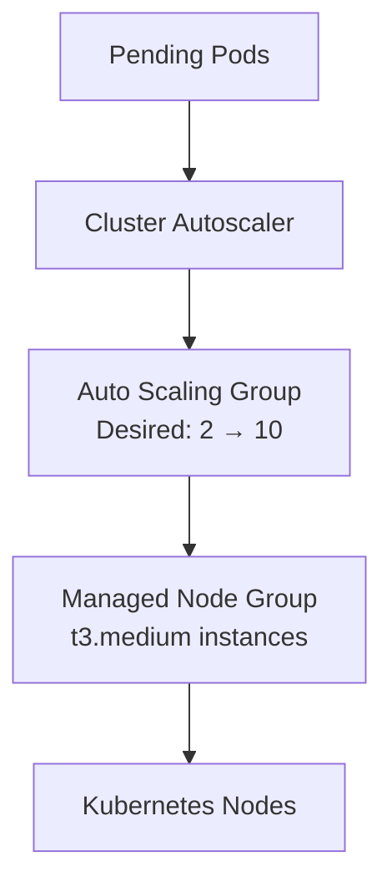
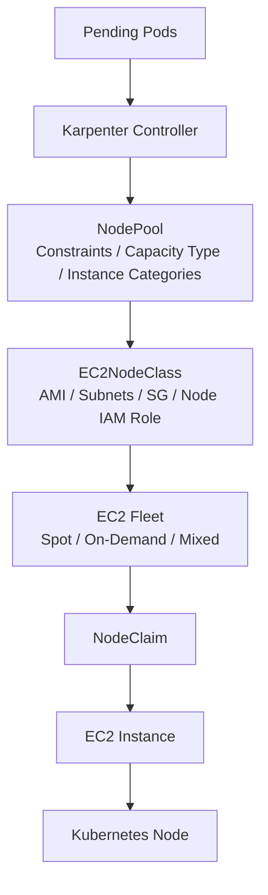
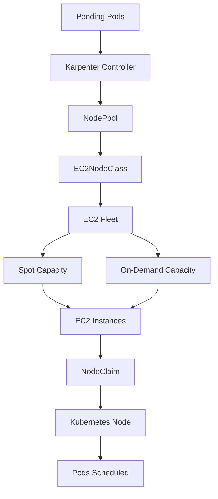

# ⚡ Karpenter on Amazon EKS

### Replacing Cluster Autoscaler with Karpenter for Faster Provisioning and Cost Optimization


---

## 📌 Project Overview

This project demonstrates a hands-on migration from **Kubernetes Cluster Autoscaler (CA)** to **Karpenter** on Amazon EKS, benchmarking both solutions across the metrics that actually matter in production:

- Scale-up latency
- Scale-down efficiency
- Bin packing
- Consolidation
- Drift detection
- Spot support
- Cost optimization
- Operational simplicity

---

## 🏗️ Architecture

### Cluster Autoscaler



**Limitations:** depends on ASGs, fixed instance families, slow provisioning, limited bin packing, no consolidation, no drift detection.

### Karpenter



### End-to-End Solution Flow



---

## 🧩 Components

### Amazon EKS
Managed Kubernetes control plane, API server, scheduler, auth, and networking integration.

```text
Cluster Version: EKS 1.33
```

### Metrics Server
Powers Cluster Autoscaler, HPA, and Karpenter scheduling decisions.

```bash
kubectl top nodes
kubectl top pods
```

### Cluster Autoscaler
Scales node groups by adjusting ASG desired capacity.

```bash
helm install cluster-autoscaler
```

**Features:** ASG-based scaling, managed node groups, scale-up/down
**Limitations:** slow, no consolidation, no drift detection, fixed instance types

### Karpenter
Provisions EC2 instances directly — no ASG or Managed Node Group dependency.

```text
Pending Pods → Karpenter → NodePool → NodeClaim → EC2 Fleet → EC2 Instance → Node Registration → Pod Scheduling
```

### EC2NodeClass
Defines the infrastructure layer — AMI, IAM role, security groups, subnets, tags.

```yaml
apiVersion: karpenter.k8s.aws/v1
kind: EC2NodeClass
spec:
  amiFamily: AL2023
  amiSelectorTerms:
    - alias: al2023@latest
  role: KarpenterNodeRole-autoscaling-lab
  subnetSelectorTerms:
    - tags:
        karpenter.sh/discovery: autoscaling-lab
  securityGroupSelectorTerms:
    - tags:
        karpenter.sh/discovery: autoscaling-lab
```

### NodePool
Defines scheduling constraints — capacity type, consolidation policy, limits, instance families, AZs.

```yaml
requirements:
  - key: karpenter.sh/capacity-type
    operator: In
    values:
      - on-demand
  - key: karpenter.k8s.aws/instance-category
    operator: In
    values:
      - t
```

### NodeClaim
Represents an actual node request through its lifecycle:

```text
Created → Launched → Registered → Initialized → Ready
```

```bash
kubectl get nodeclaims
kubectl describe nodeclaim
```

### EC2 Fleet
Used internally by Karpenter for dynamic instance selection, Spot optimization, and flexible placement.

```text
t3a.2xlarge   t3.2xlarge   m6a.large   c7g.large
```

---

## 🔐 IAM Components

| Role | Purpose |
|---|---|
| **KarpenterControllerRole** | Used by the Karpenter controller — EC2, Pricing API, SQS, IAM, STS permissions |
| **KarpenterNodeRole** | Attached to worker nodes — `AmazonEKSWorkerNodePolicy`, `AmazonEKS_CNI_Policy`, `AmazonEC2ContainerRegistryPullOnly`, `AmazonSSMManagedInstanceCore` |

**aws-auth ConfigMap**

```yaml
mapRoles:
  - rolearn: arn:aws:iam::ACCOUNT_ID:role/KarpenterNodeRole-autoscaling-lab
    username: system:node:{{EC2PrivateDNSName}}
    groups:
      - system:bootstrappers
      - system:nodes
```

---

## 📉 Consolidation

Karpenter continuously removes unused capacity:

```text
5 Nodes → 4 Nodes → 3 Nodes → 2 Nodes
```

```yaml
disruption:
  consolidationPolicy: WhenEmptyOrUnderutilized
  consolidateAfter: 30s
```

---

## 🔄 Drift Detection

Karpenter detects configuration drift and replaces nodes with zero manual intervention:

| State | Instance Type |
|---|---|
| Current | `t3a.2xlarge` |
| Desired | `m6a.large` |

Flow: **detect drift → launch new nodes → evict workloads → terminate old nodes**

---

## 💰 Spot Instances

```yaml
requirements:
  - key: karpenter.sh/capacity-type
    operator: In
    values:
      - spot
```

Mixed capacity (Spot + On-Demand fallback):

```yaml
values:
  - spot
  - on-demand
```

**Benefits:** significant cost savings, automatic fallback, better utilization

---

## 📊 Benchmark Results

| Metric | Cluster Autoscaler | Karpenter |
|---|---|---|
| Scale Up | 2–4 min | 30–60 sec |
| Scale Down | 10–15 min | 30–90 sec |

### Feature Comparison

| Feature | Cluster Autoscaler | Karpenter |
|---|---|---|
| ASG Dependency | ✅ Yes | ❌ No |
| Dynamic Instance Selection | ❌ No | ✅ Yes |
| EC2 Fleet | ❌ No | ✅ Yes |
| Bin Packing | ⚠️ Limited | ✅ Excellent |
| Consolidation | ❌ No | ✅ Yes |
| Drift Detection | ❌ No | ✅ Yes |
| Spot Support | ⚠️ Basic | ✅ Native |
| Scale Up | 2–4 min | 30–60 sec |
| Scale Down | 10–15 min | <1 min |
| Cost Optimization | ⚠️ Medium | ✅ High |

### Real Numbers

```text
Cluster Autoscaler → 10 × t3.medium      → ≈2–4 minutes provisioning
Karpenter          → 4 × t3a.2xlarge     → ≈30–60 seconds provisioning
Potential Cost Reduction: ≈40–60%
```

---

## 📁 Project Structure

```text
karpenter-setup/
├── cluster-autoscaler/
├── karpenter/
│   ├── EC2NodeClass.yaml
│   └── NodePool.yaml
├── workloads/
│   └── inflate.yaml
├── screenshots/
├── comparison/
├── docs/
└── README.md
```

---

## ✅ Hands-on Validation

**Cluster Autoscaler**

```bash
kubectl get deployment
kubectl top nodes
kubectl get nodes
```

**Karpenter**

```bash
kubectl get nodeclaims
kubectl get nodepool
kubectl get ec2nodeclass
kubectl logs deployment/karpenter -n kube-system
```

---

## 🎯 Key Learnings

- Cluster Autoscaler depends on Auto Scaling Groups; Karpenter provisions instances directly.
- Karpenter selects optimal instance types and performs efficient bin packing.
- Consolidation reduces wasted capacity automatically.
- Drift detection simplifies node upgrades with zero manual intervention.
- Native Spot support significantly reduces infrastructure cost.
- EC2 Fleet integration dramatically improves provisioning speed (2–4 min → 30–60 sec).

---

## 🚀 Future Enhancements

- [ ] GPU NodePools
- [ ] Multi-AZ scheduling
- [ ] Reserved Instances & Savings Plans
- [ ] Spot interruption handling
- [ ] Capacity reservations
- [ ] Workload isolation
- [ ] Cost dashboards (Grafana + Prometheus)

---

## 👤 Author

**Rabindranath Kornu**
DevOps Engineer

`Amazon EKS` • `Kubernetes` • `Karpenter` • `AWS` • `Platform Engineering`
